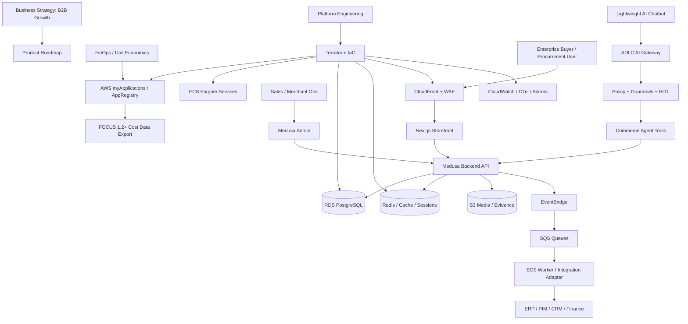

# Business Proposal & Implementation Blueprint
## B2B Headless Ecommerce Platform for FSI/Energy: Medusa B2B Starter vs Vercel Commerce

**Prepared for:** CEO / CFO / CTO  
**Prepared by:** Principal Cloud/Solutions Architecture & Product Strategy  
**Date:** 2026-06-03  
**Decision Context:** Greenfield B2B ecommerce platform for FSI/Energy customers, hosted on AWS in a new account, built with Terraform IaC, integrated with ADLC-governed lightweight AI chatbot/AI-agent orchestration, and aligned to FinOps FOCUS 1.2+ for 2026-2030 operating discipline.

---

## 1. Executive Decision

### Recommendation

**Adopt Medusa's active `medusajs/b2b-starter` as the commerce foundation.**  
Do **not** build the core platform on the linked legacy `medusajs/b2b-starter-medusa` repository, because its README now states that it is deprecated and redirects users to `medusajs/b2b-starter`.

**Use Vercel Commerce selectively as a frontend/UX reference only**, not as the system of record or B2B commerce backend.

### Board-level decision statement

> We should build the new B2B ecommerce platform on Medusa B2B Starter because our business problem is not a simple online storefront. It is a regulated, account-based, quote-to-order B2B commerce platform requiring company accounts, buyer roles, spending limits, approval workflows, quote negotiation, order editing, ERP/PIM integration, AI-assisted customer and operations workflows, and auditable FinOps governance. Medusa gives us the backend commerce primitives and B2B workflows. Vercel Commerce is a strong Next.js storefront pattern, but it is not the best foundation for FSI/Energy B2B commerce.

### Strategic outcome

The recommended platform becomes a **digital B2B quote-to-order channel** and a **governed AI-assisted commercial operations platform**, not merely a product catalogue website.

---

## 2. Decision Scorecard

### Scoring method

Scores are weighted by relevance to the target business model: FSI/Energy B2B, enterprise procurement, regulated operating model, AWS-first hosting, Terraform IaC, AI-agent integration, and FinOps FOCUS cost governance.

| Criteria | Weight | Medusa B2B Starter (`medusajs/b2b-starter`) | Vercel Commerce | Why it matters |
|---|---:|---:|---:|---|
| Native B2B workflow fit | 18 | **17** | 6 | B2B needs company accounts, employee roles, spending limits, approvals, quote management, and order edits. |
| Headless backend ownership | 12 | **11** | 5 | We need control over commerce workflows, not just a storefront template. |
| FSI/Energy regulated operating fit | 12 | **10** | 5 | FSI/Energy procurement requires approval, audit, policy, and account-based commercial terms. |
| AWS self-hosting fit | 10 | **9** | 7 | Medusa can be containerized as backend/storefront/workers on ECS/Fargate. Vercel Commerce is Vercel/Shopify-oriented by default. |
| Terraform IaC fit | 8 | **8** | 6 | Medusa services map naturally to ECS, RDS PostgreSQL, Redis, S3, ALB, WAF, CloudFront, and AppRegistry. |
| ADLC / AI-agent integration fit | 12 | **11** | 7 | Medusa workflows and APIs provide safer boundaries for read-only and HITL-controlled write actions. |
| FinOps FOCUS 1.2+ alignment | 8 | **8** | 6 | Self-hosted AWS resources can be tagged, exported, and allocated by application/component/customer capability. |
| Frontend performance and UX | 6 | 5 | **6** | Vercel Commerce is excellent as a Next.js storefront reference. Medusa also uses Next.js 15 in the active starter. |
| Extensibility for ERP/PIM/CRM | 8 | **8** | 4 | Medusa is better suited to custom workflows and commerce modules. |
| OSS maturity and operational risk | 6 | 4 | **5** | Vercel Commerce has broader visibility; Medusa's active B2B starter is newer but more fit-for-purpose. |
| **Total** | **100** | **91 / 100** | **57 / 100** | Medusa wins due to B2B backend and workflow fit. |

### Important nuance

| Repository | Recommendation | Reason |
|---|---|---|
| `medusajs/b2b-starter-medusa` | **Do not start here** | Marked deprecated; useful as historical reference only. |
| `medusajs/b2b-starter` | **Use this** | Active Medusa B2B starter with monorepo structure, Medusa backend, and Next.js storefront. |
| `vercel/commerce` | **Reference only** | Excellent Next.js ecommerce UI pattern, but actively maintained around Shopify provider and weaker for B2B backend ownership. |

---

## 3. Executive Rationale by Stakeholder

### CEO perspective: revenue channel, differentiation, speed

**Why this matters:**  
The platform should support enterprise buying behavior, not consumer checkout behavior. FSI/Energy customers do not simply browse and pay by credit card; they negotiate, request quotes, work within delegated authority, involve procurement, and require evidence.

**CEO value proposition:**

- Creates a new digital B2B revenue channel for enterprise customers.
- Reduces friction from quote request to order placement.
- Supports account-based selling and customer-specific commercial terms.
- Enables AI-assisted buying journeys without losing governance.
- Differentiates the business through self-service procurement, guided product discovery, and faster commercial response.

**CEO success metrics:**

| KPI | Target Direction | Why |
|---|---|---|
| Quote-to-order cycle time | Reduce | Faster sales conversion. |
| Digital order share | Increase | More revenue through self-service. |
| Manual sales/admin effort per order | Reduce | Operating leverage. |
| Customer onboarding time | Reduce | Faster enterprise adoption. |
| Customer satisfaction / NPS | Increase | Easier procurement experience. |
| Repeat order rate | Increase | Better B2B customer retention. |

---

### CFO perspective: cost transparency, unit economics, FinOps

**Why this matters:**  
A platform built from scratch must not become another opaque cloud cost center. Every service must be tagged and measurable from day one.

**CFO value proposition:**

- Establishes application-level cost visibility using AWS myApplications/AppRegistry.
- Aligns cost data with FinOps FOCUS 1.2+ terminology and export structures.
- Enables cost-per-quote, cost-per-order, cost-per-customer-account, and cost-per-agent-interaction metrics.
- Supports showback/chargeback by business capability, environment, product, and component.
- Avoids premature EKS/MSK/OpenSearch complexity until business demand justifies it.

**CFO operating dashboard:**

| Metric | Owner | Cadence | Purpose |
|---|---|---:|---|
| Monthly platform cost | CFO / FinOps | Monthly | Total run-rate visibility. |
| Cost per order | CFO / Product | Weekly | Unit economics. |
| Cost per quote | CFO / Sales Ops | Weekly | B2B commercial efficiency. |
| Cost per active company account | CFO / Product | Monthly | Customer economics. |
| Cost per AI-agent interaction | CFO / CTO | Weekly | Prevent uncontrolled AI spend. |
| Non-production idle cost | CloudOps | Weekly | Immediate optimization lever. |
| NAT/data-transfer cost | CloudOps | Weekly | Common hidden AWS cost leakage. |
| RDS utilization vs cost | CTO / CloudOps | Weekly | Database right-sizing. |

---

### CTO perspective: architecture, control, security, delivery

**Why this matters:**  
The CTO needs a platform that can be extended, integrated, governed, tested, and operated without vendor lock-in or architectural dead ends.

**CTO value proposition:**

- Medusa provides backend commerce primitives and B2B workflows.
- AWS ECS/Fargate provides a lower-operational-overhead runtime than EKS for the MVP.
- Terraform creates repeatable, auditable infrastructure from day one.
- ADLC governance controls AI-agent actions through policy, evidence, test gates, and HITL approvals.
- EventBridge/SQS supports asynchronous integration with ERP, PIM, CRM, finance, and support systems.
- PostgreSQL provides a strong transactional foundation for early-stage B2B commerce.

**CTO success metrics:**

| KPI | Target Direction | Why |
|---|---|---|
| Deployment frequency | Increase | Faster product iteration. |
| Change failure rate | Reduce | Safer delivery. |
| Mean time to restore | Reduce | Operational resilience. |
| Infrastructure drift | Zero tolerance | Terraform governance. |
| Security finding SLA | Improve | FSI/Energy compliance. |
| Agent action audit coverage | 100% | AI governance. |
| Critical workflow test coverage | Increase | Commerce integrity. |

---

## 4. Target Product Scope

### MVP product capabilities

The MVP should focus on the workflows that prove real B2B commercial value.

| Capability | MVP Scope | Why it matters |
|---|---|---|
| Company accounts | Create/manage company, buyer users, admin users | B2B account model. |
| Buyer roles | Buyer, company admin, sales manager, platform admin | Delegated authority. |
| Spending limits | Per-user/per-period spend limits | Procurement control. |
| Cart approval | Approval before checkout/order placement | Prevent unauthorized spend. |
| Quote request | Buyer submits quote request | Core B2B commercial flow. |
| Quote negotiation | Sales/merchant responds with price/terms | Enterprise sales support. |
| Order editing | Admin/sales can adjust order/quote details | B2B exception handling. |
| Product catalogue | Product pages, categories, collections | Discovery and ordering. |
| Bulk add-to-cart | Multi-line ordering | B2B efficiency. |
| Audit/evidence events | Log quote, approval, agent, and order actions | Compliance and ADLC governance. |
| FinOps tags | Tag application, component, owner, environment | Cost allocation from day one. |

### Explicit non-goals for MVP

These should be intentionally deferred to avoid over-engineering.

| Non-goal | Why defer |
|---|---|
| EKS/Kubernetes-first platform | Too much operational overhead for greenfield MVP. ECS/Fargate is faster and cheaper to operate. |
| Full marketplace model | Adds seller, settlement, tax, and dispute complexity. |
| OpenSearch from day one | Use simpler product search until catalogue scale justifies search infrastructure. |
| Kafka/MSK from day one | EventBridge/SQS is sufficient for early integration. |
| Fully autonomous order approval by AI | Too risky for regulated B2B. Use AI for assistance, not final authority. |
| Complex multi-region active-active | Start with robust single-region architecture plus backup/restore and DR roadmap. |

---

## 5. Proposed Target Architecture

### Architecture principles

1. **B2B-first, not storefront-first.** Commerce workflows are the product core.
2. **API-first and headless.** Storefront, chatbot, admin, and integrations consume governed APIs.
3. **AWS-native but portable enough.** Use managed AWS services where they reduce undifferentiated operations.
4. **Terraform-only infrastructure.** No manual production resources.
5. **FinOps tags are mandatory.** Untagged resources fail CI policy.
6. **AI agents are governed actors.** Read-only by default; write actions require policy, tests, and HITL approval.
7. **Evidence by design.** Every quote/order/approval/agent action emits audit events.
8. **Start small, scale deliberately.** ECS/Fargate first; EKS only when platform complexity justifies it.

### Logical architecture



### Runtime architecture

| Layer | AWS Service | Purpose | MVP Decision |
|---|---|---|---|
| Edge | CloudFront | Global caching and TLS edge | Required |
| Security edge | AWS WAF | Managed rules, bot controls, IP allow/deny | Required |
| Load balancing | ALB | Route backend/storefront traffic | Required |
| Runtime | ECS Fargate | Run Medusa backend, Next.js storefront, ADLC gateway, workers | Required |
| Database | RDS PostgreSQL | Transactional commerce database | Required |
| Cache | ElastiCache Redis or lightweight Redis | Session/job/cache support | Start optional, enable when needed |
| Object storage | S3 | Media, exports, evidence, logs | Required |
| Secrets | Secrets Manager | DB/API secrets | Required |
| Encryption | KMS | Encryption keys | Required |
| Events | EventBridge | Domain events | Required |
| Queue | SQS | Async processing and retry | Required |
| Observability | CloudWatch + OpenTelemetry | Logs, metrics, traces, alarms | Required |
| Cost governance | Data Exports + FOCUS 1.2 | Standardized cost data | Required |
| Application model | Service Catalog AppRegistry / myApplications | Application-centric cost/security/ops view | Required |
| Security detection | GuardDuty / Security Hub | Baseline security posture | Required |

---

## 6. ADLC-Governed AI Integration Blueprint

### AI design principle

The AI chatbot/agent layer must assist buyers, sales, and operations teams, but it must **not bypass deterministic commerce rules**.

### Agent capability ladder

| Level | Capability | Example | Risk | MVP Decision |
|---:|---|---|---|---|
| 0 | Informational chat | Explain product categories, terms, order status | Low | Include |
| 1 | Read-only commerce tools | `get_product`, `get_quote_status`, `get_order_status` | Low | Include |
| 2 | Draft actions | Draft quote request, draft cart approval note | Medium | Include with evidence |
| 3 | Controlled write actions | Submit quote request, submit support case | Medium | Include with policy |
| 4 | High-risk write actions | Approve order, change price, change spend limit | High | Defer / HITL only |
| 5 | Autonomous commercial decisions | Auto-approve large orders, override pricing | Very high | Explicitly excluded |

### Proposed AI tools

| Tool | Access | Human approval | Audit evidence | Purpose |
|---|---|---|---|---|
| `search_catalog` | Read | No | Yes | Help buyer find products. |
| `get_product_details` | Read | No | Yes | Explain specs, availability, compatibility. |
| `get_company_policy` | Read | No | Yes | Explain purchasing rules. |
| `get_quote_status` | Read | No | Yes | Customer/self-service update. |
| `draft_quote_request` | Draft | Optional | Yes | Reduce buyer effort. |
| `submit_quote_request` | Write | Policy-gated | Yes | Create commercial intent. |
| `draft_approval_summary` | Draft | Yes for final use | Yes | Help company admin approve/reject. |
| `create_support_case` | Write | No for low risk | Yes | Operational support. |
| `recommend_reorder` | Draft | No | Yes | B2B repeat order productivity. |
| `change_spending_limit` | Write | Mandatory HITL | Yes | Sensitive financial control. |
| `approve_order` | Write | Mandatory HITL | Yes | Regulated approval. |

### ADLC evidence event schema

```json
{
  "event_id": "uuid",
  "timestamp": "2026-06-03T00:00:00Z",
  "actor_type": "human|agent|system",
  "actor_id": "user-or-agent-id",
  "agent_name": "quote-assistant",
  "tool_name": "submit_quote_request",
  "commerce_object_type": "quote|cart|order|company|product",
  "commerce_object_id": "object-id",
  "risk_level": "low|medium|high|critical",
  "policy_decision": "allow|deny|require_human_approval",
  "human_approver": "user-id-if-applicable",
  "input_hash": "sha256",
  "output_hash": "sha256",
  "evidence_uri": "s3://...",
  "trace_id": "otel-trace-id"
}
```

### AI guardrails

| Guardrail | Control |
|---|---|
| No direct price override | Only deterministic pricing service can calculate final price. |
| No autonomous approval | Order/quote approvals require human or explicit policy rule. |
| No unrestricted customer data access | Tool-level ABAC/RBAC by company, role, and tenant. |
| No hidden actions | Every tool call emits audit evidence. |
| No prompt-only security | Enforce authorization in backend APIs and middleware. |
| No untested agent release | ADLC eval set must pass before deployment. |

---

## 7. FinOps FOCUS 1.2+ Blueprint

### FinOps design goal

The platform should produce board-ready cost transparency from day one. Cost governance should not be retrofitted after cloud spend becomes material.

### Mandatory AWS tags

| Tag | Example | Required? | Purpose |
|---|---|---:|---|
| `Application` | `b2b-commerce` | Yes | Application-level grouping. |
| `awsApplication` | AppRegistry ARN | Yes | myApplications/AppRegistry grouping. |
| `Environment` | `dev`, `staging`, `prod` | Yes | Environment allocation. |
| `Component` | `medusa-backend`, `storefront`, `ai-gateway`, `worker`, `database` | Yes | Component showback. |
| `Product` | `OceanSoft-ADLC-Commerce` | Yes | Product P&L. |
| `BusinessCapability` | `quote-to-order`, `catalog`, `approval`, `customer-account` | Yes | Business capability costing. |
| `Owner` | `platform-engineering` | Yes | Accountability. |
| `CostCenter` | `fsi-energy-b2b` | Yes | Finance allocation. |
| `DataClassification` | `public`, `internal`, `confidential`, `regulated` | Yes | Governance and security. |
| `ManagedBy` | `terraform` | Yes | Drift control. |
| `Repo` | `b2b-commerce-platform` | Yes | Traceability. |
| `ADLCPhase` | `discover`, `build`, `run`, `optimize` | Optional | ADLC lifecycle reporting. |

### FOCUS-aligned cost views

| View | Audience | Question answered |
|---|---|---|
| Executive cost summary | CEO/CFO | Are platform costs growing in line with revenue? |
| Unit economics | CFO/Product | What is cost per quote/order/company account? |
| Component cost | CTO/CloudOps | Which service drives spend? |
| Environment cost | CTO/FinOps | Are dev/staging costs controlled? |
| AI cost governance | CFO/CTO | What is the cost per AI-agent interaction or task? |
| Customer/account cost proxy | Product/Sales | Which enterprise accounts drive infrastructure and support load? |

### CFO-grade unit economics

| Unit metric | Formula |
|---|---|
| Cost per quote | Monthly platform cost allocated to quote workflow / number of quote requests |
| Cost per order | Monthly platform cost allocated to order workflow / number of orders |
| Cost per active company | Monthly platform cost / active company accounts |
| Cost per agent interaction | AI gateway + model/API + evidence storage cost / agent interactions |
| Cost per approval | Approval workflow cost / approval decisions |
| Gross digital margin proxy | Digital gross margin - allocated platform cost |

### Early cost controls

| Control | Implementation |
|---|---|
| Budget alarms | AWS Budgets by environment and application. |
| No untagged resources | CI policy blocks Terraform plan/apply when required tags are missing. |
| Non-prod schedule | Scale down or stop non-prod services outside business hours. |
| NAT minimization | Use VPC endpoints for S3/CloudWatch/ECR where justified. |
| RDS right-sizing | Start small; monitor CPU, memory, IOPS, connections. |
| ECS autoscaling | Scale on CPU/memory/request count. |
| AI quotas | Per-agent, per-user, and per-company limits. |
| Evidence retention policy | Keep high-value audit evidence; lifecycle cold/archive storage. |

---

## 8. Terraform and Repository Blueprint

### Recommended monorepo

```text
b2b-commerce-platform/
├── apps/
│   ├── backend/                 # Medusa backend
│   ├── storefront/              # Next.js storefront
│   ├── adlc-ai-gateway/         # Lightweight agent gateway
│   └── workers/                 # Integration/event workers
│
├── packages/
│   ├── commerce-tools/          # Agent-safe commerce tool SDK
│   ├── policy-engine/           # Tool authorization / HITL policies
│   ├── event-schemas/           # Quote/order/approval/evidence schemas
│   └── ui-components/           # Shared design system
│
├── infra/
│   └── terraform/
│       ├── envs/
│       │   ├── dev/
│       │   ├── staging/
│       │   └── prod/
│       └── modules/
│           ├── appregistry/
│           ├── network/
│           ├── security-baseline/
│           ├── ecs-service/
│           ├── rds-postgres/
│           ├── redis/
│           ├── cloudfront-waf/
│           ├── eventing/
│           ├── observability/
│           └── finops-focus-export/
│
├── adlc/
│   ├── policies/
│   ├── evals/
│   ├── evidence-schemas/
│   ├── runbooks/
│   └── approval-matrix/
│
├── docs/
│   ├── architecture/
│   ├── adr/
│   ├── product/
│   ├── security/
│   ├── finops/
│   └── runbooks/
│
└── .github/
    └── workflows/
```

### Terraform module responsibilities

| Module | Responsibilities |
|---|---|
| `appregistry` | AppRegistry application, application tag, resource associations, myApplications visibility. |
| `network` | VPC, subnets, routing, endpoints, security groups, NAT strategy. |
| `security-baseline` | KMS, IAM boundaries, CloudTrail, Config, GuardDuty, Security Hub. |
| `ecs-service` | Reusable service definition, task role, execution role, autoscaling, log group. |
| `rds-postgres` | RDS instance/cluster, backups, subnet group, parameter group, alarms. |
| `redis` | Redis only when needed for session/cache/job performance. |
| `cloudfront-waf` | Distribution, WAF rules, TLS, origin access, headers. |
| `eventing` | EventBridge bus, SQS queues, DLQs, retry policies. |
| `observability` | Dashboards, alarms, log retention, traces. |
| `finops-focus-export` | Cost export bucket, Glue/Athena integration, reporting views. |

### CI/CD gates

| Gate | Rule |
|---|---|
| Formatting | Prettier, ESLint, Terraform fmt. |
| Type safety | TypeScript build must pass. |
| Unit tests | Commerce and policy logic covered. |
| Integration tests | Company, quote, approval, cart, order workflows. |
| IaC validation | Terraform validate/plan. |
| Security scanning | Dependency, IaC, secrets, container scanning. |
| Tag policy | Required FinOps tags enforced. |
| ADLC evals | Agent tools and prompts pass eval set before release. |
| Human approval | Required for production deployment. |

---

## 9. Delivery Roadmap

### Phase 0 — Executive approval and discovery, 1-2 weeks

| Deliverable | Owner | Exit criteria |
|---|---|---|
| Business case approval | CEO/CFO/CTO | Decision to proceed. |
| MVP scope lock | Product/CTO | Capabilities and non-goals agreed. |
| Risk register | CTO/Security | Top risks documented. |
| Initial cost model | CFO/FinOps | Budget envelope agreed. |
| Account strategy | Cloud Architect | New AWS account pattern approved. |

### Phase 1 — Local working software, 2-3 weeks

| Deliverable | Owner | Exit criteria |
|---|---|---|
| Medusa B2B Starter local | Engineering | Backend and storefront running. |
| PostgreSQL local | Engineering | Migrations and seed data complete. |
| Basic company workflow | Product/Engineering | Company, buyer, admin roles work. |
| Quote workflow | Product/Engineering | Quote request and response works. |
| Approval workflow | Product/Engineering | Approval required and enforced. |
| ADLC evidence schema | AI/Platform | Tool call evidence schema defined. |

### Phase 2 — AWS development environment, 3-4 weeks

| Deliverable | Owner | Exit criteria |
|---|---|---|
| Terraform baseline | CloudOps | VPC, ECS, RDS, S3, WAF deployed. |
| AppRegistry/myApplications | CloudOps/FinOps | Application visible with tagged resources. |
| CI/CD pipeline | Platform | Dev deployment automated. |
| Observability | Platform/SRE | Logs, metrics, alarms available. |
| Security baseline | Security | GuardDuty, Security Hub, KMS, CloudTrail. |
| FOCUS export | FinOps | FOCUS data export configured. |

### Phase 3 — ADLC AI-assisted workflows, 3-4 weeks

| Deliverable | Owner | Exit criteria |
|---|---|---|
| AI gateway MVP | AI/Platform | Chatbot calls read-only tools. |
| Commerce tools | AI/Backend | Product/order/quote status tools. |
| Policy engine | AI/Security | Write actions policy-gated. |
| HITL approval | Product/AI | Sensitive actions require approval. |
| Evidence logging | AI/SRE | Tool call evidence stored and searchable. |
| Agent evals | AI/Product | Eval set passes release gate. |

### Phase 4 — Pilot with internal/sandbox customers, 4-6 weeks

| Deliverable | Owner | Exit criteria |
|---|---|---|
| Pilot customer journey | Product | End-to-end quote-to-order tested. |
| ERP/PIM mock integration | Integration | Events and adapters validated. |
| Security review | Security/CTO | Critical findings resolved. |
| CFO dashboard | FinOps | Cost-per-workflow dashboard available. |
| Runbooks | SRE/Platform | Incident, rollback, backup, restore docs ready. |
| Go/no-go decision | Exec team | Production readiness decision. |

### Phase 5 — Production release and optimization, ongoing

| Deliverable | Owner | Exit criteria |
|---|---|---|
| Production launch | CTO/Product | First controlled production release. |
| Customer onboarding | Sales/Product | First B2B customer account onboarded. |
| FinOps review | CFO/CloudOps | First monthly cost review completed. |
| Post-launch review | CEO/CTO | Benefits, defects, and roadmap agreed. |
| Optimization backlog | Product/FinOps | PDCA backlog prioritized. |

---

## 10. Governance and RACI

| Area | CEO | CFO | CTO | Product Owner | CloudOps | Security | AI/ADLC Lead | Engineering |
|---|---|---|---|---|---|---|---|---|
| Business case | A | C | C | R | C | C | C | C |
| Platform decision | A | C | A/R | R | C | C | C | C |
| MVP scope | A | C | A | R | C | C | C | R |
| Cloud cost governance | C | A | R | C | R | C | C | C |
| Security/compliance | C | C | A | C | R | A/R | C | R |
| AI tool governance | C | C | A | C | C | C | A/R | R |
| Terraform delivery | I | C | A | C | R | C | C | R |
| Production release | A | C | A/R | R | R | R | R | R |

Legend: **A** = Accountable, **R** = Responsible, **C** = Consulted, **I** = Informed.

---

## 11. Risk Register

| Risk | Probability | Impact | Mitigation |
|---|---:|---:|---|
| Active Medusa B2B starter is newer and has fewer stars than old repo | Medium | Medium | Freeze validated version; create internal fork; invest in tests; monitor upstream. |
| Legacy repo confusion | High | Medium | Standardize on `medusajs/b2b-starter`; block use of deprecated repo in ADR. |
| B2B requirements expand beyond MVP | High | High | Use strict MVP scope and product backlog governance. |
| AI agent performs unauthorized commercial action | Medium | High | Read-only by default; policy engine; HITL; evidence logging; backend enforcement. |
| Cloud cost grows without allocation | Medium | High | Mandatory tags, AppRegistry, FOCUS export, budget alarms, CFO dashboard. |
| ERP/PIM integration complexity | Medium | High | Use event-driven adapter pattern; pilot with mock integration first. |
| Security/compliance gaps for FSI/Energy | Medium | High | Security baseline from day one; threat modeling; audit evidence; least privilege. |
| Performance bottlenecks in product search/catalog | Medium | Medium | Start simple; add OpenSearch only when justified by catalogue scale and query complexity. |
| Operational complexity from premature Kubernetes | Medium | Medium | Use ECS/Fargate first; revisit EKS only if platform scaling requires it. |
| Vendor lock-in concern | Low/Medium | Medium | Keep commerce logic in Medusa and Terraform; avoid Vercel/Shopify dependency as core. |

---

## 12. Enterprise Architecture Decision Records

### ADR-001: Commerce foundation

**Decision:** Use `medusajs/b2b-starter` as the core commerce foundation.  
**Status:** Proposed.  
**Rationale:** Best fit for B2B workflows: company management, spending limits, approval workflows, quote management, order editing, bulk add-to-cart, promotions, product/cart/checkout/order history.  
**Rejected alternatives:** Vercel Commerce as core platform; deprecated `b2b-starter-medusa` as source repo.  
**Consequence:** We own backend workflow customization and can integrate AI/ADLC safely.

### ADR-002: Runtime platform

**Decision:** Use ECS Fargate for MVP and initial production.  
**Status:** Proposed.  
**Rationale:** Faster, lower operational burden, sufficient for containerized backend/storefront/workers/AI gateway.  
**Rejected alternative:** EKS-first.  
**Consequence:** Simpler operational model; revisit EKS if multi-team platform complexity grows.

### ADR-003: IaC and application governance

**Decision:** Terraform-first with AWS myApplications/AppRegistry tagging.  
**Status:** Proposed.  
**Rationale:** Required for repeatability, auditability, and app-centric cost/security/operations visibility.  
**Consequence:** Manual production changes are exceptions and must be remediated back to code.

### ADR-004: AI agent operating model

**Decision:** ADLC-governed AI gateway with read-first tools and HITL-controlled writes.  
**Status:** Proposed.  
**Rationale:** Regulated B2B commerce requires audit, approval, and deterministic enforcement.  
**Consequence:** AI accelerates workflows but does not bypass commercial authority or backend policy.

### ADR-005: FinOps standard

**Decision:** Use FinOps FOCUS 1.2+ as the cost data alignment model.  
**Status:** Proposed.  
**Rationale:** Provides standardized cost and usage terminology for allocation, budgeting, forecasting, and cross-platform governance.  
**Consequence:** Cost tags, exports, and dashboards are part of MVP acceptance criteria.

---

## 13. CEO/CFO/CTO Presentation Narrative

### Slide 1 — Decision

We recommend Medusa B2B Starter as the commerce foundation and AWS ECS/Fargate as the initial runtime. Vercel Commerce should be used only as a UX/reference pattern.

### Slide 2 — Why now

Enterprise customers increasingly expect digital self-service, but FSI/Energy buying still requires quote, approval, procurement, and audit. A B2B portal reduces friction while preserving commercial governance.

### Slide 3 — Why Medusa

Medusa's active B2B starter includes company management, buyer roles, spending limits, approval workflows, quote management, order editing, bulk ordering, and ecommerce flows. This is closer to the target operating model than a storefront-first template.

### Slide 4 — Why not Vercel Commerce as core

Vercel Commerce is a high-performance Next.js storefront template and is actively maintained around Shopify. It is excellent for UX inspiration, but it is not the strongest core for regulated B2B quote-to-order workflows.

### Slide 5 — Architecture

AWS-hosted Medusa backend, Next.js storefront, ADLC AI Gateway, RDS PostgreSQL, EventBridge/SQS integration layer, S3 evidence store, CloudFront/WAF edge, and Terraform/AppRegistry/FOCUS FinOps governance.

### Slide 6 — CFO controls

Every resource is tagged, registered to the application model, and exported into FOCUS 1.2-compatible cost reporting. CFO gets cost-per-order, cost-per-quote, cost-per-company, and cost-per-agent-interaction.

### Slide 7 — CTO controls

Terraform-only infrastructure, CI/CD quality gates, security scanning, deterministic backend authorization, ADLC evals for AI tools, and production deployment approval.

### Slide 8 — Delivery roadmap

A 12-18 week path to controlled production: discovery, local working software, AWS development environment, ADLC AI tools, pilot, and production release.

### Slide 9 — Key risks

Main risks are newer active Medusa B2B starter maturity, B2B scope creep, AI-agent governance, integration complexity, and cost control. Each has a defined mitigation.

### Slide 10 — Ask

Approve Phase 0 and Phase 1: business case, MVP scope, AWS account baseline, Medusa local build, Terraform foundation, and ADLC evidence design.

---

## 14. Immediate Next Actions

### First 10 actions

1. Create an ADR confirming `medusajs/b2b-starter` as the source baseline.
2. Create the new AWS account and baseline guardrails.
3. Create Terraform remote state and provider structure.
4. Create AppRegistry/myApplications application model.
5. Define mandatory FinOps tags and CI enforcement.
6. Fork or vendor-lock the validated Medusa B2B starter version.
7. Run local backend/storefront with PostgreSQL.
8. Validate company, quote, approval, and order workflows.
9. Define ADLC AI Gateway tool boundaries and evidence schema.
10. Produce CEO/CFO/CTO Phase 1 checkpoint with demo and cost dashboard skeleton.

### Definition of success for first executive checkpoint

| Outcome | Evidence |
|---|---|
| Product value proven | Live demo of company account, quote, approval, order flow. |
| Architecture credible | Terraform plan and AWS dev architecture diagram. |
| Cost governance credible | AppRegistry application and required tag policy defined. |
| AI governance credible | Read-only AI tool with evidence log. |
| Security credible | IAM/KMS/WAF/CloudTrail/GuardDuty baseline design. |
| Delivery credible | Backlog, roadmap, RACI, and risk register approved. |

---

## 15. Source References

1. Medusa B2B Starter Medusa legacy repo, deprecated notice: https://github.com/medusajs/b2b-starter-medusa
2. Medusa active B2B Starter repo: https://github.com/medusajs/b2b-starter
3. Medusa B2B Starter update: https://medusajs.com/blog/b2b-starter-update-mar25/
4. Vercel Commerce repo: https://github.com/vercel/commerce
5. AWS myApplications for Terraform-managed applications: https://aws.amazon.com/blogs/mt/getting-started-with-myapplications-for-terraform-managed-applications/
6. AWS AppRegistry `awsApplication` tag: https://docs.aws.amazon.com/servicecatalog/latest/arguide/ar-user-tags.html
7. FinOps FOCUS Specification v1.2: https://focus.finops.org/focus-specification/v1-2/
8. AWS FOCUS 1.2 with AWS columns: https://docs.aws.amazon.com/cur/latest/userguide/table-dictionary-focus-1-2-aws.html
9. ADLC Framework: https://adlc.oceansoft.io/
10. ADLC Agent Teams pillar: https://adlc.oceansoft.io/pillars/agent-teams/

---

## 16. Final Recommendation

Proceed with a **Medusa B2B Starter + AWS ECS/Fargate + Terraform + ADLC AI Gateway + FinOps FOCUS 1.2+** architecture.

This is the best strategic fit because it directly supports the commercial and governance reality of FSI/Energy B2B: company accounts, approvals, spending controls, quote negotiation, order management, ERP/PIM integration, governed AI assistance, and transparent cloud unit economics.

The platform should start small, prove quote-to-order value, and scale deliberately. Avoid premature Kubernetes, Kafka, OpenSearch, or fully autonomous AI decision-making until business demand and governance maturity justify them.
