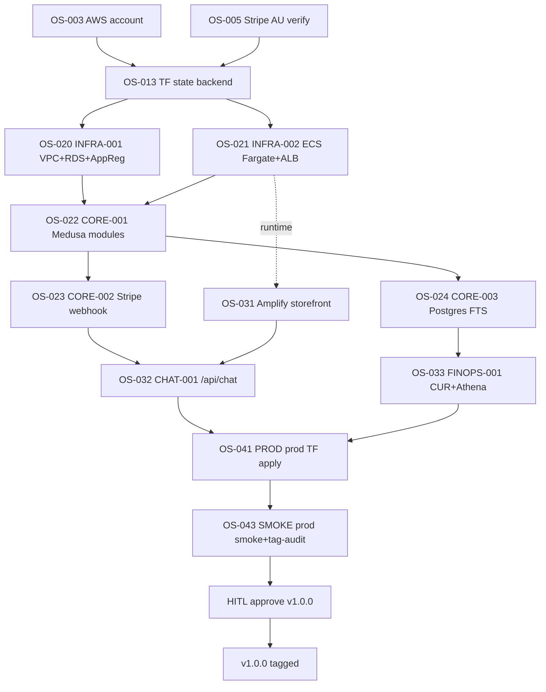

# B2B Blueprint — B2B-Commerce

> **ADR style**: Summary → Context → Decision → Consequences
> **Status**: Phase 1 (local-first) approved 2026-06-04 — Phase 2 (single AWS account) gated on Phase 1 evidence
> **Authority**: `tmp/B2B-Commerce/coordination-logs/cloud-architect-b2b-commerce-p1-2026-06-04.json`

## Executive Decision

B2B-Commerce is positioned as a **quote-assisted B2B-Commerce for ANZ regulated industries (Energy, FSI, Telecom)** — not a generic B2B storefront. Quote → Approval → PO → Invoice → SOW is the canonical workflow; spending-limit enforcement, multi-step approval, and FOCUS 1.2+ tagged infrastructure are non-negotiable defaults. The product is delivered as an open-core monorepo (MIT-licensed apps + infra + docs) with a commercial Medusa plugin (`@oceansoft/medusa-plugin-b2b`) reserved for licensee distribution.

---

## Problem Statement

ANZ regulated B2B procurement has three structural costs that mass-market storefronts ignore:

1. **Quote cycles are long and email-bound.** Field engineers identify a need, request a quote via email, wait days for an account manager to price it, then route the PDF through internal approval. Cycle time: 1–6 weeks. The system of record is the email inbox.
2. **Approvals are manual and audit-poor.** Spending limits are enforced by manager attention, not by software. When an APRA CPS 234 or Essential Eight audit asks "who approved this $50k purchase?", evidence is reconstructed from email threads.
3. **Compliance overhead is added late.** Tag-driven cost allocation, data residency posture, and access controls are retrofitted onto an unprepared storefront — usually by a finance team copying CSVs out of Stripe.

Existing options force a tradeoff:

| Option | Quote workflow | Approval gates | Compliance posture | Self-hostable |
|--------|----------------|----------------|---------------------|---------------|
| Shopify Plus B2B | Manual draft orders | App-marketplace plugins (inconsistent) | SOC2 — vendor-controlled | No |
| BigCommerce B2B Edition | Quote app — limited workflows | Single-level approval | SOC2 — vendor-controlled | No |
| SAP Commerce / Hybris | Full enterprise | Multi-level | Enterprise (heavy) | Yes — high ops cost |
| Medusa B2B (community) | None built-in | None built-in | Self-managed | Yes |
| **B2B-Commerce** | **Built-in (3 modules, 22 workflows)** | **Built-in (5 approval workflows)** | **FOCUS 1.2+ tagged IaC + ADLC governance from day 1** | **Yes — open-core** |

---

## Unfair Advantage Stack

Seven differentiators thread through every architectural decision. The stack is the moat, not any single capability.

1. **ANZ regulated cloud knowledge** — Phase 2 will land on AWS Sydney (`ap-southeast-2` or customer-configured `$AWS_DEFAULT_REGION`) and Azure Australia East with APRA CPS 234 / Essential Eight posture baked into the Terraform skeleton. Generic B2B starters do not encode regulator context.
2. **AWS + Azure + Terraform native** — single Terraform skeleton targets multi-cloud from line 1. Container base `nnthanh101/terraform:2.6.0` (CA-confirmed) is the reproducible IaC harness. Differentiates from SaaS-only competitors.
3. **FinOps FOCUS 1.2+ from line 1** — 9 mandatory tags (`Service, Environment, Owner, CostCenter, Project, BillingTag, ManagedBy, Compliance, DataClassification`) enforced via `infracost breakdown` checks in CI. Multi-tenant cost attribution wired before customer #2 onboards.
4. **Claude subagents + ADLC v1.2.0** — 7 non-negotiable principles (Acceptable Agency, Interoperability, Evaluation-First, Hybrid Deployment, Observability, Governance, Agent Engineering) constrain every commit. PO + CA coordination gates are blocking — no agent ships standalone.
5. **Evidence-first runbooks** — every claim has an evidence path in `tmp/B2B-Commerce/`. `NATO_VIOLATION` and `SKIP_EVIDENCE` are hook-blocked. Buyer-side audits land on a folder, not a story.
6. **One-HITL solo-founder operating model** — T-Shape human-in-the-loop manager coordinates 38 specialist AI agents. Low coordination tax, high velocity per sprint. Competitor teams of 5–15 cannot match the per-sprint slope with the same cost base.
7. **Energy / FSI / Telecom credibility** — alpha customer OceanSoft anchors the GTM narrative in regulated-industry references. First three customer logos targeted in Energy and FSI verticals (roadmap, not booked).

---

## Target Architecture

### Phase 1 — Local-first (current scope, approved 2026-06-04)

See [docs/architecture/local-mvp.md](./architecture/local-mvp.md) for the canonical Phase 1 4-service topology (ec_postgres_b2b, ec_redis_b2b, ec_backend_b2b, ec_storefront_b2b). Naming convention: product-flavor (`ec_*`) + B2B-mode suffix (`_b2b`); customer name is a deployment-config variable (Roadmap v0.3+), not hardcoded into service names.

### Phase 2 — Single AWS account (v0.3 roadmap)

Phase 2 lifts the Phase 1 skeleton onto a single AWS account with no application-layer changes:

- **Region**: customer-configured per deployment (`$AWS_DEFAULT_REGION` — no hardcoded default; multi-tenant)
- **Container runtime**: ECS Fargate or EKS (decision deferred to v0.3 CA coordination)
- **Data**: RDS PostgreSQL 15 + ElastiCache Redis 7 (same versions as Phase 1)
- **Application registry**: AWS myApplications + AppRegistry tags (FOCUS 1.2+ keys mirror local)
- **IaC**: Terraform modules already validated in Phase 1; provider credentials added at v0.3 deploy gate
- **Compliance tags**: `Compliance=APRA-CPS234`, `DataClassification=customer`, `ManagedBy=terraform` (CA-confirmed additions)

Per-workload AWS profiles are sourced from individual `~/.aws/config` entries — not from `$AWS_MANAGEMENT_PROFILE` (which is Organizations-only). See `.adlc/.claude/rules/engineering/aws-profile-semantics.md`.

---

## B2B Features Matrix

Honest reality check — every column maps to filesystem evidence.

| Capability | Status | Evidence path |
|------------|--------|---------------|
| Company module (entities + types) | Built | `apps/backend/src/modules/company/` |
| Quote module | Built | `apps/backend/src/modules/quote/` |
| Approval module | Built | `apps/backend/src/modules/approval/` |
| Quote workflows (9) | Built | `apps/backend/src/workflows/quote/workflows/` (create-quote, create-request-for-quote, create-quote-message, customer-accept-quote, customer-reject-quote, merchant-send-quote, merchant-reject-quote, update-quote) |
| Approval workflows (5) | Built | `apps/backend/src/workflows/approval/workflows/` (create-approvals, create-approval-settings, update-approval, update-approval-settings) |
| Company workflows (5) | Built | `apps/backend/src/workflows/company/workflows/` |
| Employee workflows (3) | Built | `apps/backend/src/workflows/employee/workflows/` |
| Spending-limit cart validation | Built | `apps/backend/src/workflows/hooks/validate-cart-completion.ts` |
| Bulk-add-to-cart validation hooks | Built | `apps/backend/src/workflows/hooks/validate-add-to-cart.ts`, `validate-update-cart.ts` |
| Storefront B2B account UI (23 components) | Built | `apps/storefront/src/modules/account/components/` (approval-card, company-card, employees-card, quote-card, etc.) |
| Order editing workflow | Partial | `apps/backend/src/workflows/order/workflows/update-order.ts` — exists; post-checkout enablement UI flow not confirmed |
| Companies REST API (public routes) | Roadmap v0.2 | Module exists in `src/modules/company/`; no `apps/backend/src/api/companies/` routes built |
| Admin API for spending-limit management | Roadmap v0.2 | UI flow not yet wired |
| Stripe / PayPal payment provider | Roadmap v0.2 | Mock provider sufficient for Playwright smoke per PO log |
| FinOps Vizro dashboards | Roadmap v0.4 | No real cost data yet |
| OpenTelemetry MELT pipeline | Roadmap v0.4 | Logged in CA out-of-scope confirmation |
| ADLC AI Gateway / agent orchestrator | **Roadmap v0.6 — ASPIRATIONAL, ZERO CODE TODAY** | No source files exist |
| Multi-tenant operator | Roadmap v0.5 | Single-tenant per licensee in v1.0 |

---

## Persona Section — Journey Maps

### Buyer-employee journey (the primary user)

1. **Login** — visits `localhost:8000/account/login`; authenticates against the customer-company employee record.
2. **Browse + add to cart** — navigates the storefront catalog; `validate-add-to-cart.ts` hook enforces B2B-only SKU eligibility.
3. **Submit quote request** — clicks "Request Quote" on cart; `create-request-for-quote.ts` workflow runs; quote-id surfaced on `/account/quotes`.
4. **Wait for approval** — quote shows `status=pending_approval` on `/account/quotes/{id}`; UI indicates approver name.
5. **Receive approved PO** — on approval, `/account/orders/{id}` shows PO number and SOW link; buyer-employee places the order.
6. **Track delivery** — `/account/orders` shows order status and any post-checkout edits.

Without the buyer-employee, no value is created — they are the trigger of every workflow.

### Admin / sales-manager journey (the gatekeeper)

1. **Login to admin UI** — visits `localhost:9000/app`; authenticates with admin-tier role.
2. **Review pending quotes** — `/admin/quotes` queue lists requests; each row shows company, requester, total, age.
3. **Negotiate price** — `update-quote.ts` workflow adjusts line items; `create-quote-message.ts` posts a buyer-visible message thread.
4. **Approve or reject** — `customer-accept-quote.ts` or `customer-reject-quote.ts` workflow runs; approval record persists with approver_id + timestamp.
5. **Manage company + employees** — `/admin/companies/{id}` shows employee roster, spending limits, approval settings.
6. **Audit trail** — every approval record is queryable; APRA CPS 234 §36 human accountability evidence is the record itself.

Both personas appear in DC-020's golden-path smoke test by design (anti-INVISIBLE_PRIMARY_USER, PO log line 132).

---

## Production-Readiness Posture

What we can credibly claim for ANZ enterprise customers today, what is roadmap.

| Dimension | Today (Phase 1) | Roadmap |
|-----------|-----------------|---------|
| Audit logging | Workflow execution records persisted in Postgres (Medusa step-state tables) | Centralised log shipper to customer SIEM (v0.4 OpenTelemetry) |
| Role-based access control | Admin tier + employee tier via Medusa auth + company employee model | Fine-grained per-resource RBAC (v0.3) |
| Data residency | Postgres in customer-controlled AWS region via `$AWS_DEFAULT_REGION` (Phase 2) | Multi-region read replicas (v0.5) |
| Encryption in transit | TLS at storefront + admin (Next/Medusa defaults) | mTLS service mesh (v0.4) |
| Encryption at rest | Postgres native encryption + AWS KMS at Phase 2 deploy | Customer-managed KMS keys (v0.4) |
| APRA CPS 234 §36 evidence | Approval records + workflow execution logs | Annual audit report bundle generator (v0.5) |
| Essential Eight posture | Container-first dev (HOST_PACKAGE_MANAGER hook-blocked); IaC for everything | Application allowlisting + macro restrictions (v0.5) |
| Disaster recovery | Phase 2 RDS automated snapshots (default 7-day retention) | Cross-region warm standby (v0.5) |
| SOC 2 Type II | Not pursued (not regulated trigger for ANZ targets) | Reassess at first US customer |

The posture is honest: we are SOC2-adjacent (audit logs + RBAC + IaC) but we do not claim SOC2 today. Regulator-grade compliance for ANZ targets (APRA CPS 234, Essential Eight) is encoded in the Terraform skeleton and tagging discipline — the foundation is built into Phase 1 even though the certifications are post-Phase 2.

---

## Consequences

**Accepted**:
- Phase 1 ships no production traffic — `terraform validate` + `infracost breakdown` only; real AWS provisioning is gated on Phase 1 evidence + HITL approval of the v0.3 CA coordination.
- ADLC AI Gateway is roadmap, not built. Marketing must not claim agent orchestration as a current capability.
- 5 of 9 Phase 1 stories have logical sequencing dependencies (DC-011 → DC-012 → DC-020); independence is 66.7%, accepted by PO as MVP-appropriate.
- Hardcoded AWS region intentionally absent — customer-configured per deployment to support multi-tenant operator model.

**Mitigated**:
- IP ownership clarity: every package.json declares OceanSoft as author; single `THIRD-PARTY-NOTICES.md` covers Medusa b2b-starter / dtc-starter MIT compliance; per-file attribution comments scrubbed at Row 5 plugin extraction (CA mitigation field).
- Plugin extraction is highest-risk task — explicit IP-scrub directive + scoped file-lock to `packages/medusa-plugin-b2b/**` only.

**Rejected**:
- Repo split to private plugin repo at Phase 1 — accelerates v0.3 instead.
- Private npm registry at Phase 1 — `workspace:` protocol sufficient.
- License-key validator at Phase 1 — no commercial customers yet.

---

## INVEST Story → Architecture Component Mapping

Each Phase 1 story maps to a concrete architecture surface. This table is the cross-reference auditors use to verify "the story shipped the thing it claimed."

| Story | Architecture surface | Verification command |
|-------|----------------------|----------------------|
| DC-001 | docker-compose.yml (4 services), Taskfile.yml (`task up`), README quickstart | `time task up` — exit 0 in <600s |
| DC-002 | `.devcontainer/devcontainer.json` references `../docker-compose.yml` | VS Code "Reopen in Container" succeeds |
| DC-010 | `packages/medusa-plugin-b2b/` workspace package | `pnpm --filter @oceansoft/medusa-plugin-b2b build` exits 0 |
| DC-011 | `apps/backend/medusa-config.ts` modules block + plugin import | Backend boots, admin `/companies` route returns 200 |
| DC-012 | `apps/storefront/src/modules/account/components/` B2B routes | Storefront `/account/quotes` returns 200 |
| DC-020 | Playwright dual-persona smoke test | `task tests:smoke` — buyer + admin assertions both pass |
| DC-030 | `infra/terraform/` modules + tags.tf | `terraform validate` exits 0 |
| DC-031 | Infracost FOCUS 1.2+ tag verification | `infracost breakdown --format json` — all FOCUS keys present |
| DC-040 | Documentation pack (this file + discovery-brief + ASSESSMENT) | All 3 docs exist; line counts within target |

---

## FinOps FOCUS 1.2+ Tag Strategy

See [ADR-001](./architecture/ADR-001-single-aws-account.md) §FOCUS Tag Set for the 9-key tag schema; see [ADR-006](./architecture/ADR-006-tag-only-github-actions.md) for the CI tag-validation merge gate (Roadmap v0.2).

---

## Anti-Pattern Watchlist (Phase 1)

Anti-patterns are tracked in the ADLC framework catalog (`.adlc/.claude/rules/governance/anti-patterns-catalog.md`). Project-specific anti-patterns flagged at PDCA scoring time.

---

## Deployment Evolution Timeline

Honest milestones with gates, not dates. Dates depend on customer pull, not engineering aspiration.

| Version | Deployment surface | Gate to advance |
|---------|---------------------|-----------------|
| v0.1 (Phase 1, current) | Local docker-compose + devcontainer | `task up` <600s, all DC-001..DC-040 ACs pass, 3-agent scoring ≥7/10 |
| v0.2 | Same local stack + Stripe mock + production seed data + REST companies API + admin spending-limit UI | First demo to a non-OceanSoft prospect; payment flow demonstrably works end-to-end |
| v0.3 (Phase 2 deploy) | Single AWS account, ECS Fargate OR EKS (CA decision deferred), RDS + ElastiCache, real Terraform provisioning | HITL approves CA v0.3 coordination log + budget envelope; first paying customer commitment |
| v0.4 | + OpenTelemetry MELT + Vizro FinOps dashboards + mTLS | First customer requesting compliance evidence bundle |
| v0.5 | + Multi-region warm standby + customer-managed KMS + multi-tenant operator scaffolding | Second paying customer (validates multi-tenant assumption) |
| v0.6 | + ADLC AI Gateway / agent orchestrator + medusa-agent-skills plugin family | AI-assisted procurement becomes a customer-asked feature, not a roadmap claim |
| v1.0 | GA — multi-tenant operator + license-key validator + commercial-plugin distribution | 3+ paying customers, churn <5% annual, NPS >40 |

The gates are explicit: we do NOT advance versions because the calendar moved; we advance because the customer signal justifies the investment.

---

## Phase 2 Delivery Sequence (Sprint 0 → v1.0.0)

Critical path drivers: Sprint 0 (OS-003 + OS-005) → Sprint 1 (OS-013) → Sprint 2 (INFRA-001/002 + CORE-001..003) → Sprint 3 (OS-031/032/033) → Sprint 4 (OS-041/043) → HITL approve. Runtime dependency arrow (OS-021 → OS-031): Amplify storefront issues server-side rendering calls into the ECS-hosted Medusa backend; storefront cannot ship until backend is up.

See [discovery-brief](./discovery-brief.md) §Phase 2 Sprint Plan for INVEST acceptance criteria and §Phase 2 Top Stories BDD Scenarios for OS-003 / OS-005 / OS-032 / OS-041 / OS-043 BDD acceptance.

---

## Decision Log Cross-References

- IP ownership: "borrow as init-draft, then own" — `.claude/memory/feedback_borrow_as_init_draft.md`
- Build for current scale: `.claude/memory/feedback_build_for_current_scale.md`
- Product vs customer brand naming: `.claude/memory/feedback_product_vs_customer_brand.md`
- 5S Sort self-check before delegation: `.claude/memory/feedback_5s_sort_before_delegation.md`
- CA stack decisions (Node 22, Medusa 2.15.5+, container base): `tmp/B2B-Commerce/coordination-logs/cloud-architect-b2b-commerce-p1-2026-06-04.json`
- PO INVEST validation (9 stories): `tmp/B2B-Commerce/coordination-logs/product-owner-b2b-commerce-p1-2026-06-04.json`
