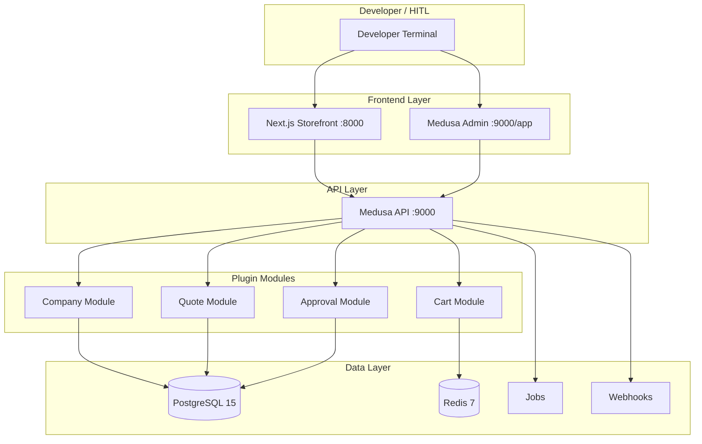

# Architecture Overview

## System Overview

B2B-Commerce is a **B2B-Commerce platform** separating concerns across three tiers:



### Repo Layout

```
B2B-Commerce/                   (MIT licensed public monorepo)
├── apps/backend/                  Medusa consumer app (thin wrapper)
│   ├── medusa-config.ts           Registers @oceansoft/medusa-plugin-b2b modules
│   ├── src/api                    API extensions (custom endpoints if any)
│   ├── src/admin                  Admin dashboard customizations
│   └── .env.template              Backend env vars (DATABASE_URL, REDIS_URL, etc.)
├── apps/storefront/               Next.js 15 App Router buyer/merchant UI
│   ├── src/app/[countryCode]/     Locale-aware routes
│   ├── src/modules/{account}      B2B account dashboard (companies, quotes, etc.)
│   └── .env.template              Storefront env vars
├── packages/medusa-plugin-b2b/    B2B commerce modules (OceanSoft Commercial License DRAFT)
│   ├── src/modules/
│   │   ├── company/               Companies, employees, spending limits
│   │   ├── quote/                 Quote requests, negotiation, pricing
│   │   └── approval/              Approval workflows, permissions
│   ├── src/workflows/             Async flow orchestration (approval, order hooks)
│   ├── src/links/                 Module relationships + event handlers
│   ├── src/index.ts               Public API exports (COMPANY_MODULE, etc.)
│   └── LICENSE.md                 OceanSoft Commercial v1.0 DRAFT
├── infra/terraform/aws/           AWS IaC, local-first via LocalStack (see ADR-015)
│   ├── modules/{tags,foundation,observability,appregistry,network,compute,data}/
│   ├── local/                     Tier-2 LocalStack root module (foundation slice)
│   ├── dev/                       Real-AWS root module (deferred apply)
│   └── staging/, prod/            LLD / plan-only (deferred v0.3)
├── docker-compose.observability.yml  Opt-in Grafana/Prometheus + exporters (ADR-007)
├── tests/e2e/                     Playwright golden-path tests
│   └── b2b-smoke.spec.ts          Login -> create company -> quote -> approval
├── docs/                          Docusaurus wiki (this site)
├── docker-compose.yml             4 services: Medusa, storefront, Postgres, Redis
├── Dockerfile                     Multi-stage build (pnpm variant per Medusa reference)
├── Taskfile.yml                   Task runner: up, down, test, tf:*, etc.
├── package.json                   Root workspace definition
├── pnpm-workspace.yaml            Monorepo configuration
├── LICENSE                        MIT
└── README.md
```

## Technology Stack

| Layer | Technology | Version |
|-------|-----------|---------|
| Backend | Medusa | 2.15.5+ |
| Frontend | Next.js App Router | 15 |
| Database | PostgreSQL | 15 |
| Cache / Queue | Redis | 7 |
| Package manager | pnpm workspace | 10.11.1+ |
| Infrastructure | Terraform | 1.9+ |
| E2E Testing | Playwright | 1.49+ |
| Runtime | Node.js | 22 |
| Container | docker-compose | 24+ |

All versions are pinned in `package.json` and `.nvmrc`.

## Key Decisions

1. **Single docker-compose.yml** — Dev Containers reuse same file as bare-metal to eliminate environment drift
2. **Plugin extracted day-1** — `packages/medusa-plugin-b2b/` enforces clean boundaries; justifies v0.3 split
3. **Terraform local-first (LocalStack)** — the AWS foundation slice (S3/Secrets/SQS/SNS) applies real on LocalStack Community at $0; same modules promote to AWS by swapping provider endpoints + one flag. See [ADR-015](./adrs/ADR-015-local-first-terraform-iac.md).
4. **Observability = Grafana/Prometheus (hybrid-cloud SSOT)** — vendor-neutral, multi-cloud (AWS+Azure), local-first in docker-compose. CloudWatch rejected as SSOT. See [ADR-007](./adrs/ADR-007-grafana-prometheus-local-first.md).
5. **No backward compatibility** — Node 22 only; Next.js 15 App Router only; modern stack, no legacy support

## AWS Deployment Roadmap

### Phase 1 (Current): Local-First

- Docker Compose for local development and CI testing
- Terraform IaC skeleton (validate-only, no resources)
- Infracost reporting (cost forecasting)

**Foundation slice (real on LocalStack now, AWS-ready):** S3 (tfstate + media), Secrets Manager, SQS+SNS — applied via `tflocal`. S3-native state lock (`use_lockfile`, no DynamoDB).

### Phase 3 (v0.3 Milestone): AWS Provisioning

Real infrastructure planned (see [ADR-015](./adrs/ADR-015-local-first-terraform-iac.md)):
- **ECS Fargate** cluster for Medusa backend + storefront
- **RDS Postgres** managed database
- **ElastiCache Redis** for sessions and job queue
- **Application Load Balancer** with Route53 DNS
- **S3** for media storage
- **AWS myApplications** (AppRegistry) for cost aggregation
- **Managed Grafana + Prometheus** (AMP/AMG) federated with Azure Managed Grafana
- **GitHub Actions** OIDC role (no long-lived credentials)

## Why We Forked (IP Boundary)

This repository was initially scaffolded from Medusa's public `dtc-starter` and `b2b-starter` repositories (both MIT). The initial code patterns and module structures were borrowed as a one-time bootstrap draft.

**From v0.1.0 onward**: All derived code is maintained as OceanSoft IP. No re-sync with upstream expected. Future Medusa framework updates are cherry-picked as feature work. See `THIRD-PARTY-NOTICES.md` for attribution.

## Observability & Security

**Phase 1 (now)**: Grafana + Prometheus local-first (opt-in `docker-compose.observability.yml`) — the hybrid-cloud, vendor-neutral observability SSOT. Metrics scrape real local targets. Container logging via `task logs`.

**Phase 3+ (hybrid-cloud)**: VPC isolation, IAM roles (OIDC), WAF on ALB. Observability promotes to managed Grafana/Prometheus (AWS AMP+AMG federated with Azure Managed Grafana). LGTM roadmap: Loki (logs) + Tempo (traces).

---

**Go deeper**: See [Architecture ADRs](./adrs/) for individual design decisions.
