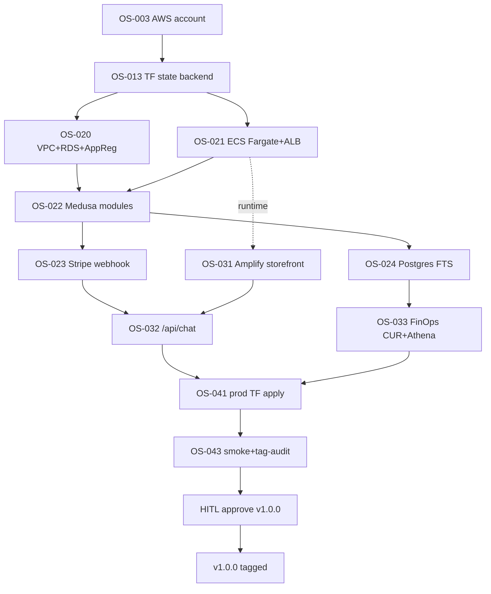

# B2B Blueprint — B2B-Commerce

> **ADR style**: Summary → Context → Decision → Consequences
> **Status**: Phase 1 (local-first) approved 2026-06-04 — Phase 2 (single AWS account) gated on Phase 1 evidence
> **Authority**: `tmp/B2B-Commerce/coordination-logs/cloud-architect-b2b-commerce-p1-2026-06-04.json`

## Executive Decision

B2B-Commerce is positioned as a **quote-assisted B2B-Commerce for ANZ regulated industries (Energy, FSI, Telecom)** — not a generic B2B storefront. Quote → Approval → PO → Invoice → SOW is the canonical workflow; spending-limit enforcement, multi-step approval, and FOCUS 1.2+ tagged infrastructure are non-negotiable defaults. The product is delivered as an open-core monorepo (MIT-licensed apps + infra + docs) with a commercial Medusa plugin (`@oceansoft/medusa-plugin-b2b`) reserved for licensee distribution.

## Problem Statement

ANZ regulated B2B procurement has three structural costs that mass-market storefronts ignore:

1. **Quote cycles are long and email-bound.** Cycle time: 1–6 weeks. The system of record is the email inbox.
2. **Approvals are manual and audit-poor.** Spending limits are enforced by manager attention, not by software. APRA CPS 234 audit evidence is reconstructed from email threads.
3. **Compliance overhead is added late.** Tag-driven cost allocation, data residency posture, and access controls are retrofitted after the fact.

| Option | Quote workflow | Approval gates | Compliance posture | Self-hostable |
|--------|----------------|----------------|---------------------|---------------|
| Shopify Plus B2B | Manual draft orders | App-marketplace plugins (inconsistent) | SOC2 — vendor-controlled | No |
| BigCommerce B2B Edition | Quote app — limited workflows | Single-level approval | SOC2 — vendor-controlled | No |
| SAP Commerce / Hybris | Full enterprise | Multi-level | Enterprise (heavy) | Yes — high ops cost |
| Medusa B2B (community) | None built-in | None built-in | Self-managed | Yes |
| **B2B-Commerce** | **Built-in (3 modules, 22 workflows)** | **Built-in (5 approval workflows)** | **FOCUS 1.2+ tagged IaC + ADLC governance from day 1** | **Yes — open-core** |

## Unfair Advantage Stack

Seven differentiators thread through every architectural decision. The stack is the moat.

1. **ANZ regulated cloud knowledge** — APRA CPS 234 / Essential Eight posture baked into Terraform skeleton.
2. **AWS + Azure + Terraform native** — single Terraform skeleton targets multi-cloud from line 1.
3. **FinOps FOCUS 1.2+ from line 1** — 8 mandatory tags enforced via `infracost breakdown` in CI.
4. **Claude subagents + ADLC v1.2.0** — 7 non-negotiable principles constrain every commit.
5. **Evidence-first runbooks** — every claim has an evidence path in `tmp/B2B-Commerce/`.
6. **One-HITL solo-founder operating model** — T-Shape HITL coordinates 38 specialist AI agents.
7. **Energy / FSI / Telecom credibility** — alpha customer OceanSoft anchors the GTM narrative.

## B2B Features Matrix

| Capability | Status | Evidence path |
|------------|--------|---------------|
| Company module (entities + types) | Built | `apps/backend/src/modules/company/` |
| Quote module | Built | `apps/backend/src/modules/quote/` |
| Approval module | Built | `apps/backend/src/modules/approval/` |
| Quote workflows (9) | Built | `apps/backend/src/workflows/quote/workflows/` |
| Approval workflows (5) | Built | `apps/backend/src/workflows/approval/workflows/` |
| Company workflows (5) | Built | `apps/backend/src/workflows/company/workflows/` |
| Employee workflows (3) | Built | `apps/backend/src/workflows/employee/workflows/` |
| Spending-limit cart validation | Built | `apps/backend/src/workflows/hooks/validate-cart-completion.ts` |
| Storefront B2B account UI (23 components) | Built | `apps/storefront/src/modules/account/components/` |
| Companies REST API (public routes) | Roadmap v0.2 | Module exists; no `apps/backend/src/api/companies/` routes yet |
| Stripe / PayPal payment provider | Roadmap v0.2 | Mock provider for Playwright smoke |
| FinOps Vizro dashboards | Roadmap v0.4 | No real cost data yet |
| OpenTelemetry MELT pipeline | Roadmap v0.4 | Logged in CA out-of-scope confirmation |
| Multi-tenant operator | Roadmap v0.5 | Single-tenant per licensee in v1.0 |

## Persona Journey Maps

### Buyer-Employee (Primary User)

1. **Login** — visits `localhost:8000/account/login`
2. **Browse + add to cart** — `validate-add-to-cart.ts` hook enforces B2B-only SKU eligibility
3. **Submit quote request** — `create-request-for-quote.ts` workflow runs; quote-id on `/account/quotes`
4. **Wait for approval** — quote shows `status=pending_approval`
5. **Receive approved PO** — on approval, `/account/orders/{id}` shows PO number
6. **Track delivery** — `/account/orders` shows order status

Without the buyer-employee, no value is created — they are the trigger of every workflow.

### Admin / Sales-Manager

1. **Login to admin UI** — visits `localhost:9000/app`
2. **Review pending quotes** — `/admin/quotes` queue
3. **Negotiate price** — `update-quote.ts` workflow; `create-quote-message.ts` posts buyer-visible message
4. **Approve or reject** — approval record persists with `approver_id + timestamp`
5. **Manage company + employees** — `/admin/companies/{id}` shows roster, spending limits, approval settings
6. **Audit trail** — every approval record queryable for APRA CPS 234 §36 evidence

## Deployment Evolution Timeline

| Version | Deployment | Gate to advance |
|---------|-----------|-----------------|
| v0.1 (Phase 1, current) | Local docker-compose + devcontainer | `task up` < 600s, all DC-001..DC-040 ACs pass |
| v0.2 | Same local + Stripe mock + production seed + REST companies API | First demo to non-OceanSoft prospect |
| v0.3 (Phase 2 deploy) | Single AWS account, ECS Fargate, RDS + ElastiCache | HITL approves CA v0.3 coordination log + budget |
| v0.4 | + OpenTelemetry MELT + Vizro dashboards + mTLS | First customer requesting compliance evidence bundle |
| v0.5 | + Multi-region warm standby + CMK + multi-tenant scaffold | Second paying customer |
| v1.0 | GA — multi-tenant operator + license-key + commercial plugin | 3+ paying customers, churn < 5%, NPS > 40 |

**Gate rule**: we do NOT advance versions because the calendar moved; we advance because the customer signal justifies the investment.

## Phase 2 Delivery Sequence

## Cross-References

- [Architecture Overview](./architecture/overview.md) — System topology
- [ADR-001](./architecture/adrs/ADR-001-single-aws-account.md) — Single AWS Account
- [ADR-015](./architecture/adrs/ADR-015-local-first-terraform-iac.md) — Local-First Terraform IaC
- [Discovery Brief](./process-qa/discovery-brief.md) — Problem statement + persona research
