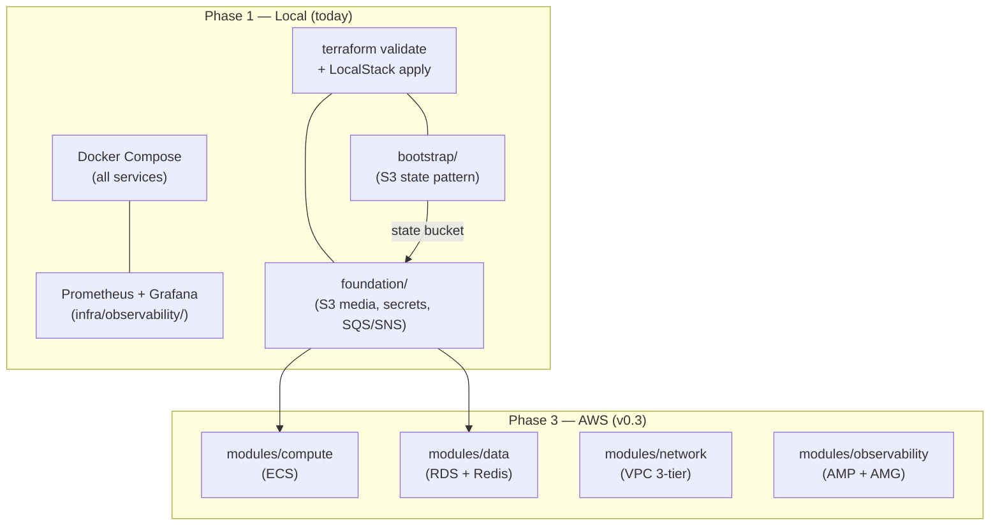

# Index: Infrastructure

Infrastructure for B2B-Commerce lives under `infra/`. At Phase 1 (today) all IaC is validate-only — no real AWS resources are provisioned. Cloud resources are provisioned at Phase 3 (v0.3, Deploy milestone).

## Pages in This Section

| Page | Type | Purpose |
|------|------|---------|
| [Entity: Terraform Bootstrap](./terraform-bootstrap.md) | Entity | The S3 state genesis module — solves the bootstrap deadlock; run-once per environment |
| [Entity: Terraform Workload Modules](./terraform-modules.md) | Entity | The 7 workload modules (tags, foundation, appregistry, network, compute, data, observability) — what each creates now vs. at v0.3 |
| [Concept: Local-First IaC](./local-first-iac.md) | Concept | The principle: validate locally (Docker + LocalStack) before any real AWS spend; the bootstrap anti-deadlock pattern |
| [Entity: Observability Stack](./observability-stack.md) | Entity | Prometheus + Grafana local stack — scrape targets, datasource uid, dashboard auto-load, AWS promotion path |

## Infrastructure at a Glance

## Read Next

- [Architecture Overview](../architecture/overview.md) — full stack diagram
- [Index: B2B Modules](../modules/index.md) — backend module pages
