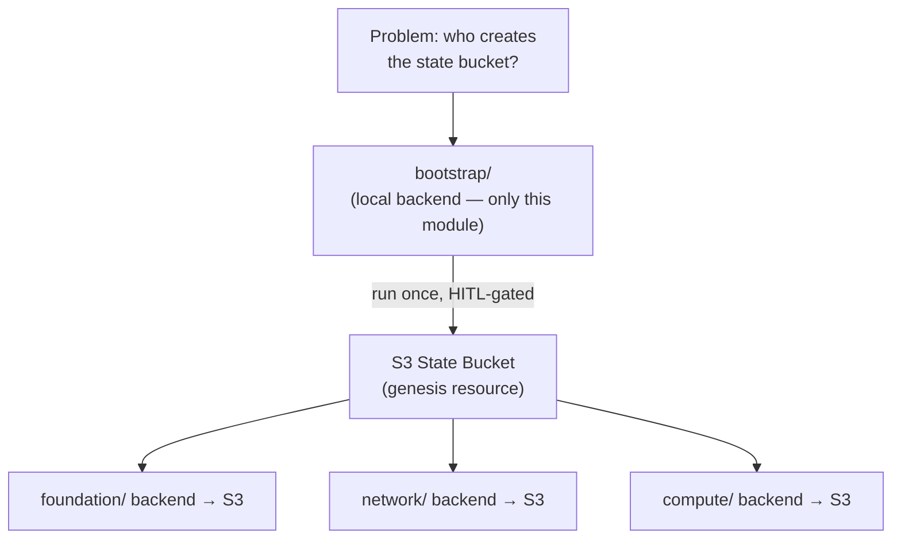

# Concept: Local-First IaC

**Problem**: Terraform modules that create AWS resources are expensive to test — every `terraform apply` against real AWS costs money, takes minutes, and leaves infra that must be cleaned up. For an early-stage product with a single HITL operator and no real AWS workloads provisioned yet (Phase 1), provisioning-against-real-AWS on every IaC change is wasteful and risky.

**The Pattern**: Validate all Terraform structure, resource definitions, and state management locally (using a local backend or LocalStack) BEFORE provisioning any real AWS resources. Real AWS apply is a HITL gate that runs only at Phase 3 (Deploy milestone, v0.3).

---

## The Two-Phase Approach

| Phase | What runs | Where | Gate owner |
|-------|-----------|-------|------------|
| **Phase 1 (today)** | `terraform validate`, `terraform plan`, LocalStack `apply` | Local Docker / LocalStack Community | Agent (autonomous) |
| **Phase 3 (v0.3)** | `terraform apply` against real AWS | Real AWS account | HITL (Principle I) |

This is not a workaround — it is a deliberate SDLC decision (ADR-015). Phase 1 proves the IaC is structurally sound and the bootstrap pattern is operationally valid before a single dollar of AWS spend.

---

## The Bootstrap Anti-Deadlock Pattern

Source: `infra/terraform/aws/bootstrap/main.tf` (lines 1–9, compiled 2026-06-07) + ADR-015 D3

The classical Terraform self-referential deadlock:

> A Terraform root module uses an S3 backend → but the S3 bucket is also managed by that same Terraform module → on first `init`, the bucket doesn't exist → Terraform cannot initialize → deadlock.

The solution: separate the state bucket creation into a **bootstrap module** that uses only a local backend. Bootstrap runs once; it creates the S3 bucket; all subsequent workload modules use that bucket as their remote backend.



**Key constraints enforced**:
- Only `bootstrap/` is allowed a local backend (ADR-015 D3 amendment)
- Bootstrap destroy = HITL-only and irreversible
- No DynamoDB lock table (not needed for single-operator dev; LocalStack Community incompatibility)

---

## LocalStack as the Tier-2 Test Environment

LocalStack Community emulates a subset of AWS APIs locally, allowing `terraform apply` to land real resources in a containerized environment without AWS credentials or cost. The B2B-Commerce IaC passes all 9 bootstrap tests against LocalStack (2026-06-05).

| Test tier | Tool | AWS credentials needed? | Cost |
|-----------|------|------------------------|------|
| Tier 1: Structural | `terraform validate` + `terraform plan` | No | $0 |
| Tier 2: Functional | LocalStack Community + `awslocal` | No | $0 |
| Tier 3: Live | Real AWS `terraform apply` | Yes — HITL | Charged |

**LocalStack limitations** to be aware of:
- `aws_s3_bucket_lifecycle_configuration` not supported in Community edition → keep `noncurrent_version_expiry_days = 0`
- DynamoDB state locking not supported → no lock table in bootstrap
- ECS, RDS, ElastiCache parity is partial in Community → network/compute/data modules defer to Tier 3

---

## Placeholder Pattern for Deferred Resources

For resources not yet implemented (network, compute, data, observability), modules use a `null_resource` placeholder that captures only the `environment` and `project` variables:

```hcl
# Example: infra/terraform/aws/modules/network/main.tf
resource "null_resource" "network_placeholder" {
  triggers = {
    environment = var.environment
    project     = var.project
  }
}
```

This means `terraform validate` and `terraform plan` succeed across the entire module tree today (Phase 1 DoD), and the real resources can be added incrementally at v0.3 without a structural refactor.

---

## FOCUS Tag Propagation

Source: `infra/terraform/aws/modules/tags/locals.tf` (lines 1–40, compiled 2026-06-07)

Every resource created by any workload module inherits 8 FOCUS 1.2+ tags via `provider.default_tags`. This ensures cost attribution is correct from first apply — not retrofitted at v0.3. Tags include: `Application`, `Service`, `Environment`, `Owner`, `CostCenter`, `ManagedBy`, `Compliance`, `DataClassification`.

---

## Comparison: Local-First vs. Always-Live

| Criterion | Local-First (this approach) | Always-Live |
|-----------|---------------------------|------------|
| Phase 1 cost | $0 | $30–200/month (VPC, RDS, ECS) |
| Feedback loop | Seconds (validate) to minutes (LocalStack apply) | 5–15 min per apply |
| Risk | Zero (no real resources) | Misconfigured SGs, unintended deletions |
| Production fidelity | Tier 1+2 (structural + functional); Tier 3 at v0.3 | Full from day 1 |
| Single HITL fit | Optimal — agent validates; HITL approves v0.3 apply | Requires HITL for every test apply |

**Decision**: Local-first was chosen (ADR-015). The 0-cost, 0-risk Phase 1 period allows the product to be fully developed and E2E tested before the first dollar of AWS infrastructure is spent.

---

## Related

- [Entity: Terraform Bootstrap](./terraform-bootstrap.md) — the concrete implementation of the anti-deadlock pattern
- [Entity: Terraform Workload Modules](./terraform-modules.md) — the modules that apply this concept
- [Entity: Observability Stack](./observability-stack.md) — local-first observability (Docker today, AMP at v0.3)
- [ADR-015](../architecture/adrs/ADR-015-local-first-terraform-iac.md) — full decision record
- [Index: Infrastructure](./index.md)
