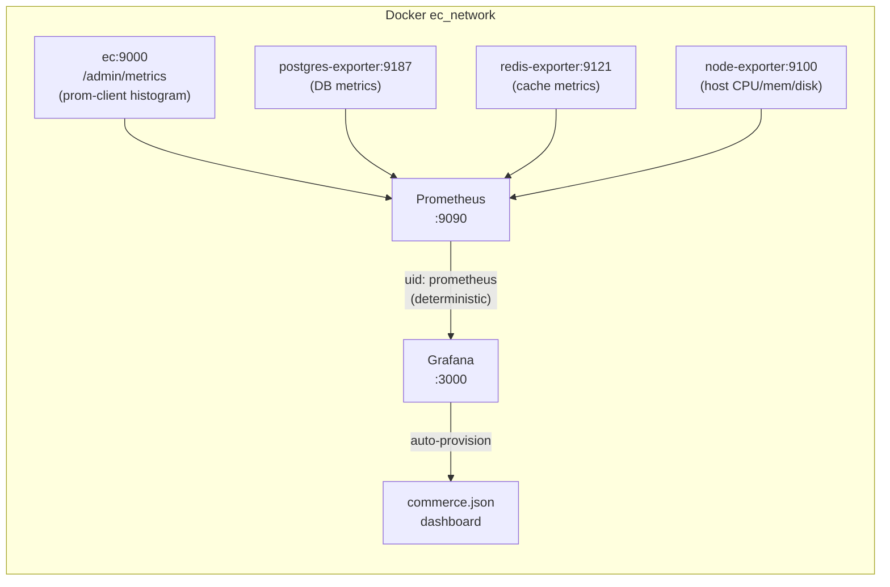

# Entity: Observability Stack

**Component path**: [`infra/observability/`](../../../infra/observability/)

**Responsibility**: Provides vendor-neutral metrics observability for the B2B-Commerce local stack. Prometheus scrapes four targets; Grafana renders the `commerce.json` dashboard via auto-provisioning. No AWS dependency — runs entirely in Docker on `ec_network`. Cloud promotion path: AWS Managed Prometheus (AMP) + Amazon Managed Grafana at v0.3.

**ADR**: [ADR-007 Grafana/Prometheus Local-First](../architecture/adrs/ADR-007-grafana-prometheus-local-first.md)

---

## Architecture



---

## Prometheus Configuration

Source: `infra/observability/prometheus/prometheus.yml` (lines 1–83, compiled 2026-06-07)

### Global Labels

```yaml
external_labels:
  environment: local
  application: b2b-commerce
  service: observability
```

These FOCUS 1.2+ labels are inherited by every scrape and enable cost/observability attribution when promoting to AMP.

### Scrape Jobs

| Job | Target | Metrics Path | What It Covers |
|-----|--------|-------------|----------------|
| `medusa` | `ec:9000` | `/admin/metrics` | HTTP request rate, latency histogram (`medusa_http_requests_total`, `medusa_http_request_duration_seconds`) |
| `postgres` | `postgres-exporter:9187` | `/metrics` | PostgreSQL connections, query duration, deadlocks |
| `redis` | `redis-exporter:9121` | `/metrics` | Cache hit rate, memory, evictions |
| `node` | `node-exporter:9100` | `/metrics` | Host CPU, memory, disk, filesystem |

**Key design note (ADR-007 amendment 2026-06-05)**: The Medusa target was changed from `backend:9000` (old `ec_network_b2b`) to `ec:9000` (`ec_network`). Basic auth was removed because `NODE_ENV != production` leaves the metrics endpoint open in dev mode. Metric names aligned to prom-client producer: `medusa_http_requests_total` / `medusa_http_request_duration_seconds`.

---

## Grafana Provisioning

### Datasource

Source: `infra/observability/grafana/provisioning/datasources/datasources.yml` (lines 1–26, compiled 2026-06-07)

```yaml
datasources:
  - name: Prometheus
    uid: prometheus          # LOAD-BEARING: must stay "prometheus"
    url: http://prometheus:9090
    access: proxy
    isDefault: true
    jsonData:
      timeInterval: "15s"
```

The datasource `uid` is the literal string `"prometheus"` (not an auto-generated UUID). Every panel in `commerce.json` references this uid. Changing it breaks all dashboards — treat as a load-bearing configuration value (CA condition `adr-004-datasource-uid-deterministic`).

### Dashboard Auto-Load

Source: `infra/observability/grafana/provisioning/dashboards/dashboards.yml` (lines 1–25, compiled 2026-06-07)

```yaml
providers:
  - name: "B2B-Commerce Dashboards"
    type: file
    options:
      path: /etc/grafana/dashboards
```

**Pattern**: Any `*.json` file dropped into `infra/observability/grafana/dashboards/` is auto-loaded by Grafana at startup (or within 30s via `updateIntervalSeconds`). No Grafana UI interaction required to add new dashboards — this is the recommended extension path.

---

## `commerce.json` Dashboard

Source: `infra/observability/grafana/dashboards/commerce.json` (compiled 2026-06-07)

| Facet | Value |
|-------|-------|
| **Grafana version** | 11.3.0+ required |
| **Datasource** | DS_PROMETHEUS (uid: prometheus) |
| **Panel types** | Time series + Stat panels |
| **Scope** | Medusa HTTP metrics + Postgres + Redis + host node metrics |

The dashboard uses Grafana's `__inputs` mechanism so it can be imported into any Grafana instance by injecting `DS_PROMETHEUS` as the datasource variable.

---

## AWS Cloud Promotion Path (v0.3)

Source: `infra/terraform/aws/modules/observability/main.tf` (compiled 2026-06-07)

The Terraform `observability` module is currently a `null_resource` placeholder (ADR-015 D6 / ADR-007 amendment). At v0.3 it will provision:

- `aws_prometheus_workspace` (AMP) — remote-write target for Prometheus
- `aws_grafana_workspace` (Amazon Managed Grafana) — cloud-hosted dashboards
- Azure Managed Grafana sibling (via `azurerm` provider)
- Loki (logs) + Tempo (traces) — planned additions

**CloudWatch was rejected** as the observability SSOT because it is AWS-only and blind to Azure. Grafana/Prometheus is vendor-neutral and runs local-first today.

---

## Facet Summary

| Facet | Value |
|-------|-------|
| **Interface** | Grafana UI at `:3000`; Prometheus at `:9090/metrics` |
| **Dependencies** | Docker `ec_network`; `ec` service (Medusa), `postgres-exporter`, `redis-exporter`, `node-exporter` |
| **Promotion path** | AMP + AMG at v0.3 (Terraform `modules/observability/`) |
| **Extension** | Drop new `*.json` into `grafana/dashboards/` — auto-loaded |
| **Alert rules** | Placeholder (`rule_files: []`) — wire in Sprint 5 CloudWatch/AMP promotion |

---

## Related

- [Concept: Local-First IaC](./local-first-iac.md) — deployment approach for this stack
- [ADR-007](../architecture/adrs/ADR-007-grafana-prometheus-local-first.md) — why Grafana/Prometheus over CloudWatch
- [ADR-016](../architecture/adrs/ADR-016-observability-under-infra.md) — why observability lives in `infra/`
- [Entity: Terraform Bootstrap](./terraform-bootstrap.md) — IaC state management
