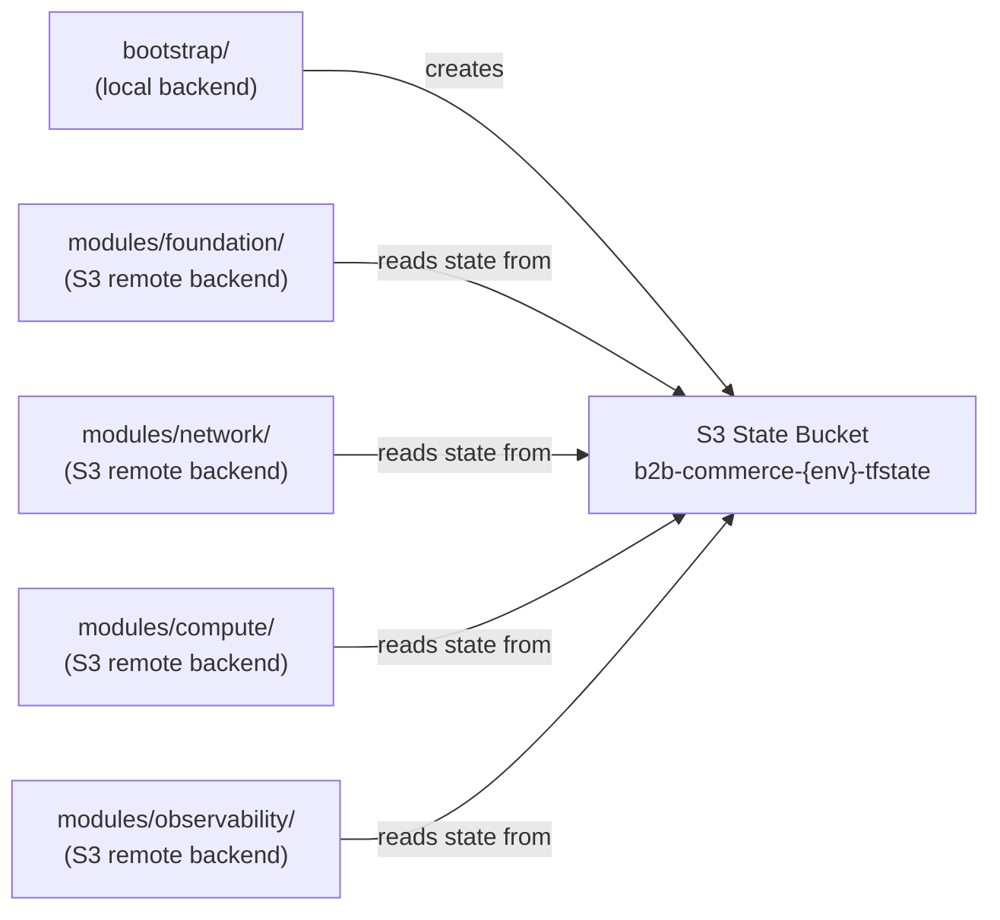

# Entity: Terraform Bootstrap

**Module path**: [`infra/terraform/aws/bootstrap/`](../../../infra/terraform/aws/bootstrap/)

**Responsibility**: Creates the S3 Terraform state bucket that all other root modules (`local`, `dev`, `staging`, `prod`) use as their remote backend. The bootstrap module itself uses a local backend — the only module in the repo permitted to do so. This design pattern avoids the self-referential deadlock (see [Concept: Local-First IaC](./local-first-iac.md)).

**ADR**: [ADR-015 Local-First Terraform IaC](../architecture/adrs/ADR-015-local-first-terraform-iac.md)

---

## Resources Created

Source: `infra/terraform/aws/bootstrap/main.tf` (lines 1–74, compiled 2026-06-07)

| Resource | Name Pattern | Purpose |
|----------|-------------|---------|
| `aws_s3_bucket.tfstate` | `{project}-{environment}-tfstate` | State bucket — the genesis resource |
| `aws_s3_bucket_versioning.tfstate` | (same bucket) | Enables state version history for rollback |
| `aws_s3_bucket_server_side_encryption_configuration.tfstate` | AES256 | Encrypts state at rest |
| `aws_s3_bucket_public_access_block.tfstate` | All block flags = true | Prevents public exposure of state |
| `aws_s3_bucket_lifecycle_configuration.tfstate` | Conditional on `var.noncurrent_version_expiry_days` | Expires old state versions (disabled by default) |

**No DynamoDB state lock table** — intentional. DynamoDB locking is not required for single-operator development workflows and LocalStack Community does not support it (see `project_tfstate_bootstrap_pattern.md` memory).

---

## Variables

Source: `infra/terraform/aws/bootstrap/variables.tf` (lines 1–32, compiled 2026-06-07)

| Variable | Default | Description |
|----------|---------|-------------|
| `environment` | `"sandbox"` | Environment whose state bucket is bootstrapped; validated enum: `sandbox`, `dev`, `staging`, `prod`, `dr` |
| `project` | `"b2b-commerce"` | Project slug; drives bucket name `{project}-{environment}-tfstate` |
| `aws_region` | (hardcoded default in `variables.tf` L24) | AWS region for the state bucket — a hardcoded default is set in source; override per customer deployment via `-var="aws_region=<region>"` or `TF_VAR_aws_region` |
| `noncurrent_version_expiry_days` | `0` | 0 = disabled; set to `90` for production environments |

**LocalStack note**: `aws_s3_bucket_lifecycle_configuration` is not supported by LocalStack Community — keep `noncurrent_version_expiry_days = 0` for Tier-2 local testing.

---

## Bucket Naming Convention

```
{project}-{environment}-tfstate
Examples:
  b2b-commerce-sandbox-tfstate
  b2b-commerce-dev-tfstate
  b2b-commerce-prod-tfstate
```

---

## Bootstrap vs. Workload Separation



**Rule**: Only `bootstrap/` uses a local backend. All workload root modules reference the bucket created by bootstrap as their S3 backend. This prevents the self-referential deadlock where a module tries to create its own state bucket.

---

## Run-Once Procedure

Source: `infra/terraform/aws/bootstrap/backend.tf` (compiled 2026-06-07)

Bootstrap is a run-once operation per environment. Destroy is HITL-gated and irreversible (destroying the bucket deletes all remote state for that environment):

```bash
# First time (local backend — creates the S3 bucket)
cd infra/terraform/aws/bootstrap
terraform init
terraform apply -var="environment=sandbox"

# After bucket exists: workload modules reference it via:
# terraform {
#   backend "s3" {
#     bucket = "b2b-commerce-sandbox-tfstate"
#     key    = "foundation/terraform.tfstate"
#     region = var.aws_region   # overrides the hardcoded default in variables.tf L24
#   }
# }
```

---

## Proven Test Results

9/9 tests passed on LocalStack (2026-06-05, `project_tfstate_bootstrap_pattern.md`):
- S3 bucket created with correct name
- Versioning enabled
- AES256 SSE configured
- All public access blocked
- State object lands after `terraform apply`
- `awslocal s3api head-object` confirms state file exists

---

## Facet Summary

| Facet | Value |
|-------|-------|
| **Backend** | Local (only this module) |
| **Region** | Hardcoded default in `variables.tf` L24 — override via `-var="aws_region=<region>"` or `TF_VAR_aws_region` per customer deployment |
| **Lock** | None (DynamoDB dropped — not needed for single-operator dev) |
| **Encryption** | AES256 (LocalStack-compatible) |
| **Versioning** | Enabled |
| **Destroy gate** | HITL-only (`prevent_destroy = false` in non-prod; set `true` before prod first-apply) |

---

## Related

- [Concept: Local-First IaC](./local-first-iac.md) — the pattern this module implements
- [Entity: Terraform Workload Modules](./terraform-modules.md) — the modules that consume this bucket
- [ADR-015](../architecture/adrs/ADR-015-local-first-terraform-iac.md) — D3 amendment: bootstrap owns genesis
- [Index: Infrastructure](./index.md)
