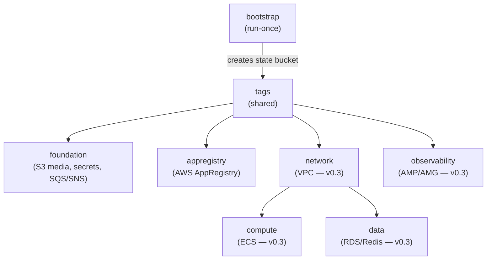

# Entity: Terraform Workload Modules

**Module path**: [`infra/terraform/aws/modules/`](https://github.com/nnthanh101/B2B-Commerce/tree/main/infra/terraform/aws/modules)

**Responsibility**: Reusable Terraform modules that provision the AWS workload layer. All modules use the S3 remote backend created by the [bootstrap module](./terraform-bootstrap.md). At Phase 1, most are `null_resource` placeholders — real resources are deferred to v0.3 (Deploy phase).

**ADR**: [ADR-015 Local-First Terraform IaC](../architecture/adrs/ADR-015-local-first-terraform-iac.md)

---

## Module Inventory

| Module | Today (Phase 1) | At v0.3 (Deploy) |
|--------|----------------|-----------------|
| **tags** | LIVE — FOCUS tag composition | Unchanged |
| **foundation** | LIVE — S3 media, 4x Secrets Manager, SQS + SNS | Unchanged |
| **appregistry** | Conditional — `count = var.enable_appregistry ? 1 : 0`; default off on LocalStack (see `main.tf` L8) | Unchanged |
| **network** | Placeholder | VPC, subnets (3 tiers), IGW, NAT, routing, SGs |
| **compute** | Placeholder | ECS cluster, tasks (backend + storefront), ALB |
| **data** | Placeholder | RDS PostgreSQL, ElastiCache Redis, subnet groups |
| **observability** | Placeholder | AMP workspace, Amazon Managed Grafana, Azure Managed Grafana |

---

## Tags Module

Source: `infra/terraform/aws/modules/tags/locals.tf` (lines 1–40, compiled 2026-06-07)

The `tags` module is the SSOT for all resource tagging across the stack. It composes 8 FOCUS 1.2+ tags:

| Tag Key | Purpose | Example Value |
|---------|---------|---------------|
| `Application` | FOCUS ServiceName — AppRegistry rollup | `b2b-commerce` |
| `Service` | Cost group-by axis | `backend` \| `storefront` \| `data` \| `async` \| `edge` |
| `Environment` | Deployment tier | `sandbox`, `dev`, `staging`, `prod` |
| `Owner` | Incident + cost escalation team | (operator-defined) |
| `CostCenter` | Finance chargeback (FOCUS BilledCost rollup) | (operator-defined) |
| `ManagedBy` | IaC traceability | `terraform` |
| `Compliance` | CSDM sn_grc control scope | (operator-defined) |
| `DataClassification` | CSDM APRA data-asset classification | (operator-defined) |

**Per-resource overrides (ADR-015 §D1)**:
- TF-state bucket and cross-cutting resources: `Service = backend`
- SQS/SNS messaging: `Service = async`
- Media bucket: `Service = storefront`

---

## Foundation Module

Source: `infra/terraform/aws/modules/foundation/main.tf` (lines 1–141, compiled 2026-06-07)

The foundation module provisions the workload-layer resources that are live today:

| Resource | Name | Notes |
|----------|------|-------|
| `aws_s3_bucket.media` | `{project}-{env}-media` | Media assets for storefront; versioning + AES256 SSE; public access blocked |
| `aws_secretsmanager_secret.database_url` | `{project}-{env}/DATABASE_URL` | Postgres connection string |
| `aws_secretsmanager_secret.redis_url` | `{project}-{env}/REDIS_URL` | Redis connection string |
| `aws_secretsmanager_secret.jwt_secret` | `{project}-{env}/JWT_SECRET` | Medusa JWT signing key |
| `aws_secretsmanager_secret.cookie_secret` | `{project}-{env}/COOKIE_SECRET` | Medusa cookie secret |
| `aws_sqs_queue.events_dlq` | `{project}-{env}-events-dlq` | Dead-letter queue; SQS-managed SSE (CKV_AWS_27) |
| `aws_sqs_queue.events` | `{project}-{env}-events` | Medusa event bus queue; redrive to DLQ after 5 receives |
| `aws_sns_topic.events` | `{project}-{env}-events` | Medusa event bus topic; KMS alias/aws/sns (CKV_AWS_26) |
| `aws_sns_topic_subscription.events_to_sqs` | — | SNS → SQS subscription wiring |

**CloudWatch NOT included** — dropped per ADR-015 D6/ADR-007 amendment. Grafana/Prometheus is the observability SSOT.

---

## Placeholder Modules (v0.3 targets)

### Network module

Source: `infra/terraform/aws/modules/network/main.tf` (lines 1–11, compiled 2026-06-07)

Three-tier VPC layout planned for v0.3:
- **Public tier** — ALB only
- **Private tier** — ECS tasks (backend + storefront)
- **Isolated tier** — RDS PostgreSQL + ElastiCache Redis

### Compute module

Source: `infra/terraform/aws/modules/compute/main.tf` (lines 1–10, compiled 2026-06-07)

ECS-based container hosting for v0.3:
- `aws_ecs_cluster` — shared cluster
- `aws_ecs_task_definition` — separate task defs for backend (port 9000) and storefront (port 8000)
- `aws_ecs_service` — desired count, rolling deploy
- `aws_lb` + listener + target group — ALB fronting both services

### Data module

Source: `infra/terraform/aws/modules/data/main.tf` (lines 1–10, compiled 2026-06-07)

Managed data tier for v0.3:
- `aws_db_instance` — RDS PostgreSQL 15
- `aws_elasticache_replication_group` — Redis 7
- Subnet groups for each (placed in isolated tier)

### Observability module

Source: `infra/terraform/aws/modules/observability/main.tf` (lines 1–27, compiled 2026-06-07)

Cloud promotion of the local Grafana/Prometheus stack for v0.3:
- `aws_prometheus_workspace` (AMP) — remote-write endpoint
- `aws_grafana_workspace` (Amazon Managed Grafana)
- Azure Managed Grafana (via `azurerm` provider sibling)
- Loki + Tempo destinations planned

---

## Module Dependency Order

---

## Related

- [Entity: Terraform Bootstrap](./terraform-bootstrap.md) — creates the state bucket all modules use
- [Concept: Local-First IaC](./local-first-iac.md) — the philosophy behind this two-phase approach
- [Entity: Observability Stack](./observability-stack.md) — the local stack that the observability module will promote
- [ADR-015](../architecture/adrs/ADR-015-local-first-terraform-iac.md)
- [Index: Infrastructure](./index.md)
