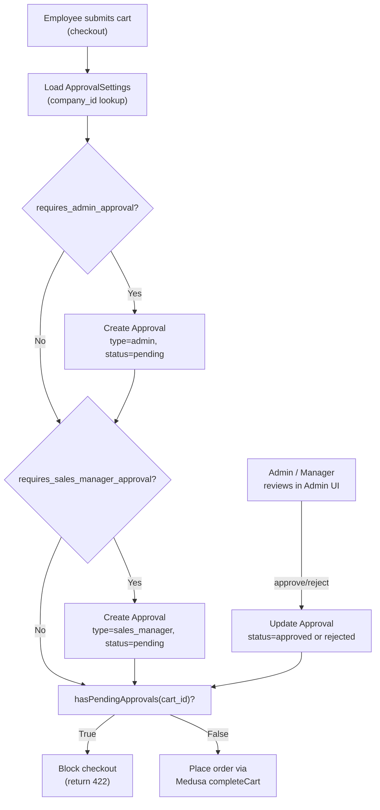

# Entity: Approval Module

**Module path**: [`apps/backend/src/modules/approval`](https://github.com/nnthanh101/B2B-Commerce/tree/main/apps/backend/src/modules/approval)

**Responsibility**: Enforces company-level purchase approval gates. Before a B2B cart can be converted to an order, it may require sign-off from a company admin, a sales manager, or both — depending on the company's `ApprovalSettings`. The module tracks each approval request, its type, and its resolution.

---

## Models

### Approval

Source: `apps/backend/src/modules/approval/models/approval.ts` (lines 1–15, compiled 2026-06-07)

| Field | Type | Notes |
|-------|------|-------|
| `id` | text (PK, prefix `appr`) | Auto-generated with `appr_` prefix |
| `cart_id` | text | The cart awaiting approval |
| `type` | enum (`ApprovalType`) | Who must approve — see type table below |
| `status` | enum (`ApprovalStatusType`) | Current state of this approval request |
| `created_by` | text | Employee ID who submitted the cart |
| `handled_by` | text \| null | Admin/manager ID who acted on the approval |

#### ApprovalType values

These are defined in `apps/backend/src/types/approval/module.ts` (lines 26–35):

| Value | Meaning |
|-------|---------|
| `admin` | Company admin must approve |
| `sales_manager` | Sales manager must approve |

#### ApprovalStatusType values

| Value | Meaning |
|-------|---------|
| `pending` | Awaiting decision |
| `approved` | Approved — cart may proceed to order |
| `rejected` | Rejected — buyer must revise or cancel |

### ApprovalSettings

Source: `apps/backend/src/modules/approval/models/approval-settings.ts` (lines 1–12, compiled 2026-06-07)

Per-company configuration for approval requirements:

| Field | Type | Notes |
|-------|------|-------|
| `id` | text (PK, prefix `apprset`) | Auto-generated |
| `company_id` | text | References the company this setting belongs to |
| `requires_admin_approval` | boolean | Default false — when true, all carts need admin approval |
| `requires_sales_manager_approval` | boolean | Default false — when true, all carts need sales-manager approval |

Both flags can be true simultaneously — in that case, TWO approval records are created (one per type) and both must be approved before the order proceeds.

### ApprovalStatus

Source: `apps/backend/src/modules/approval/models/approval-status.ts` (lines 1–12, compiled 2026-06-07)

A read-side aggregate showing the overall approval state for a cart:

| Field | Type | Notes |
|-------|------|-------|
| `id` | text (PK, prefix `apprstat`) | Auto-generated |
| `cart_id` | text | The cart being tracked |
| `status` | enum (`ApprovalStatusType`) | Aggregate resolved status for storefront display |

---

## Service

Source: `apps/backend/src/modules/approval/service.ts` (lines 1–18, compiled 2026-06-07)

`ApprovalModuleService` extends `MedusaService` and adds one custom method:

```typescript
// apps/backend/src/modules/approval/service.ts
async hasPendingApprovals(cartId: string): Promise<boolean> {
  const [_, count] = await this.listAndCountApprovals({
    cart_id: cartId,
    status: ApprovalStatusType.PENDING,
  })
  return count > 0
}
```

**`hasPendingApprovals(cartId)`** — used by checkout workflows as a guard: if any approval is still `pending` for a given cart, the cart cannot be converted to an order. This is the single enforcement point that prevents unapproved purchases from slipping through.

---

## Module Registration

Source: `apps/backend/src/modules/approval/index.ts` (lines 1–8, compiled 2026-06-07)

```typescript
export const APPROVAL_MODULE = "approval"
export default Module(APPROVAL_MODULE, { service: ApprovalModuleService })
```

---

## Approval Gate Flow



---

## Migrations

Source: `apps/backend/src/modules/approval/migrations/` (compiled 2026-06-07)

| File | Date | Change |
|------|------|--------|
| `Migration20250107125144.ts` | 2025-01-07 | Initial approval table |
| `Migration20250108113324.ts` | 2025-01-08 | `approval_settings` table |
| `Migration20250113133737.ts` | 2025-01-13 | `approval_status` aggregate table |
| `Migration20250115144941.ts` | 2025-01-15 | `handled_by` nullable column |
| `Migration20250130105122.ts` | 2025-01-30 | Status enum extension |

---

## Related

- [Entity: Company Module](./company-module.md) — `ApprovalSettings.company_id` references a Company
- [Entity: Quote Module](./quote-module.md) — approval gates also guard quote-to-order conversion
- [Architecture Overview](../architecture/overview.md)
- [Index: Modules](./index.md)
- [ADR-004: Next.js Server Actions](../architecture/adrs/ADR-004-next-js-server-action.md) — storefront action pattern used in approval UI
- [ADR-006: Tag-Only GitHub Actions](../architecture/adrs/ADR-006-tag-only-github-actions.md) — CI/CD pipeline that deploys approval module changes
- [Process QA: Dev Workflow Hooks](../process-qa/dev-workflow-hooks.md) — hook constraints for approval module development
