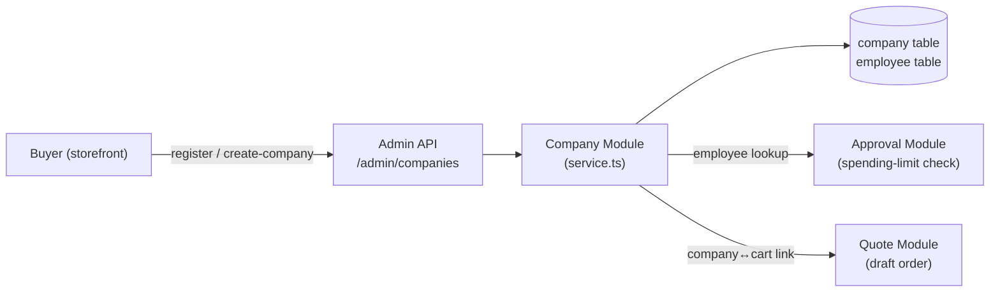

# Entity: Company Module

**Module path**: [`apps/backend/src/modules/company`](https://github.com/nnthanh101/B2B-Commerce/tree/main/apps/backend/src/modules/company)

**Responsibility**: Manages B2B company accounts and their employees, including per-employee spending limits and admin-role flags. This is the identity and authorization spine for all B2B flows — every quote, approval, and bulk order traces back to a Company + Employee pair.

---

## Models

### Company

Source: `apps/backend/src/modules/company/models/company.ts` (lines 1–24, compiled 2026-06-07)

| Field | Type | Notes |
|-------|------|-------|
| `id` | text (PK, prefix `comp`) | Auto-generated with `comp_` prefix |
| `name` | text | Company display name |
| `email` | text | Primary contact email |
| `phone` | text \| null | Optional |
| `address`, `city`, `state`, `zip`, `country` | text \| null | Billing/shipping address fields |
| `logo_url` | text \| null | Brand logo for storefront display |
| `currency_code` | text \| null | Overrides default currency for this account |
| `spending_limit_reset_frequency` | enum | `never` \| `daily` \| `weekly` \| `monthly` \| `yearly`; default `monthly` |
| `employees` | has-many | Linked `Employee` records |

**Key design note**: `spending_limit_reset_frequency` drives the scheduler that resets per-employee cumulative spend. Set to `never` for unlimited-spend accounts.

### Employee

Source: `apps/backend/src/modules/company/models/employee.ts` (lines 1–15, compiled 2026-06-07)

| Field | Type | Notes |
|-------|------|-------|
| `id` | text (PK, prefix `emp`) | Auto-generated with `emp_` prefix |
| `spending_limit` | bigNumber | Per-period spending cap in lowest currency unit; default 0 (unlimited) |
| `is_admin` | boolean | Admin employees can manage company settings; default false |
| `company` | belongs-to | Back-reference to the parent `Company` |

---

## Service

Source: `apps/backend/src/modules/company/service.ts` (lines 1–9, compiled 2026-06-07)

`CompanyModuleService` extends `MedusaService` with both `Company` and `Employee` entities. This gives it auto-generated CRUD methods: `createCompanies`, `listCompanies`, `retrieveCompany`, `updateCompanies`, `deleteCompanies`, and the employee equivalents.

```typescript
// apps/backend/src/modules/company/service.ts
import { MedusaService } from "@medusajs/framework/utils"
import { Company, Employee } from "./models"

class CompanyModuleService extends MedusaService({
  Company,
  Employee,
}) {}

export default CompanyModuleService
```

No custom methods are added beyond MedusaService defaults — the service is intentionally minimal. Custom spending-limit reset logic lives in workflows that consume this service.

---

## Module Registration

Source: `apps/backend/src/modules/company/index.ts` (lines 1–8, compiled 2026-06-07)

```typescript
export const COMPANY_MODULE = "company"

export default Module(COMPANY_MODULE, {
  service: CompanyModuleService,
})
```

The module key `"company"` is used by the Medusa container for dependency injection. Other modules resolve it via `container.resolve("company")`.

---

## Data Flow



---

## Migrations

Source: `apps/backend/src/modules/company/migrations/` (compiled 2026-06-07)

| File | Date | Change |
|------|------|--------|
| `Migration20240930144912.ts` | 2024-09-30 | Initial company + employee tables |
| `Migration20241001085304.ts` | 2024-10-01 | Address fields added |
| `Migration20241014114520.ts` | 2024-10-14 | `spending_limit_reset_frequency` added |
| `Migration20250107125154.ts` | 2025-01-07 | `currency_code` nullable, model refinements |

---

## Related

- [Entity: Approval Module](./approval-module.md) — uses `company_id` in `ApprovalSettings`
- [Entity: Quote Module](./quote-module.md) — quotes are initiated by employees of a company
- [Concept: Local-First IaC](../infrastructure/local-first-iac.md) — how the company module is deployed
- [Architecture Overview](../architecture/overview.md)
