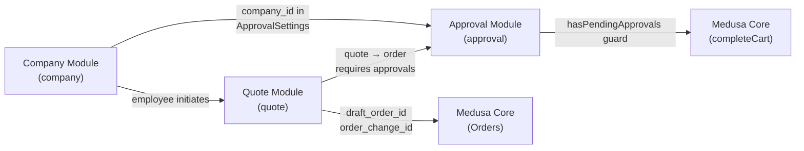

# Index: B2B Backend Modules

The three custom B2B modules live under `apps/backend/src/modules/`. Each is a self-contained Medusa v2 module with models, migrations, and a service. They are NOT upstream packages — they are first-party code owned by this repo (see [ADR-008](../architecture/adrs/ADR-008-medusa-modules-reuse-vs-new.md) and [ADR-009](../architecture/adrs/ADR-009-apps-as-first-party-not-upstream.md)).

| Page | Module Key | Responsibility |
|------|-----------|----------------|
| [Entity: Company Module](./company-module.md) | `company` | B2B company accounts + employees with spending limits |
| [Entity: Quote Module](./quote-module.md) | `quote` | Price-negotiation state machine + message thread |
| [Entity: Approval Module](./approval-module.md) | `approval` | Per-company purchase-approval gates (admin + sales-manager roles) |

## Module Dependency Map



## Container Keys

```typescript
container.resolve("company")   // CompanyModuleService
container.resolve("quote")     // QuoteModuleService
container.resolve("approval")  // ApprovalModuleService
```

## Read Next

- [Concept: Local-First IaC](../infrastructure/local-first-iac.md) — how these modules are deployed
- [Entity: Observability Stack](../infrastructure/observability-stack.md) — how module metrics are captured
- [Entity: Terraform Bootstrap](../infrastructure/terraform-bootstrap.md) — S3 state genesis module
- [Entity: Terraform Workload Modules](../infrastructure/terraform-modules.md) — 7 workload modules (tags, foundation, network, compute, data, observability)
- [Architecture Overview](../architecture/overview.md)
- [ADR-010: Medusa OOTB Extended](../architecture/adrs/ADR-010-medusa-ootb-extended.md) — why B2B modules extend Medusa OOTB rather than replace it
