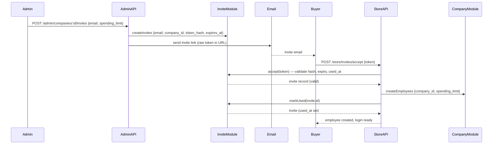

# Entity: Invite Module

**Module path**: [`apps/backend/src/modules/invite`](https://github.com/nnthanh101/B2B-Commerce/tree/main/apps/backend/src/modules/invite)

**Responsibility**: Manages token-based invitations that allow company admins to onboard new employees into their B2B account. An invite is issued by a company admin, delivered via email, and consumed once by the invited user — at which point it is marked used and a new Employee record is created under the company.

---

## Models

### Invite

Source: `apps/backend/src/modules/invite/models/invite.ts` (lines 1–16, compiled 2026-06-09)

| Field | Type | Notes |
|-------|------|-------|
| `id` | text (PK, prefix `inv`) | Auto-generated with `inv_` prefix |
| `email` | text | Email address of the invited person |
| `company_id` | text | References the `company` that issued the invite |
| `token_hash` | text | SHA-256 hash of the invite token sent in the email link; unique index |
| `spending_limit` | bigNumber \| null | Optional per-employee spending cap to pre-assign on acceptance |
| `expires_at` | dateTime | When the invite link expires |
| `used_at` | dateTime \| null | Timestamp when the invite was accepted; null = not yet used |

**Key design notes**:
- `token_hash` is stored (not the raw token) — the raw token lives only in the email link, giving zero-knowledge storage.
- A unique index on `token_hash` (excluding soft-deleted rows) prevents token collisions and replay.
- `company_id` has a foreign key to `company.id` — invites are scoped to exactly one company.

---

## Service

Source: `apps/backend/src/modules/invite/service.ts` (lines 1–45, compiled 2026-06-09)

`InviteModuleService` extends `MedusaService` and adds two custom methods on top of the auto-generated CRUD:

### `accept(token: string): Promise<InviteDTO>`

Validates an invite by its raw token. Hashes the incoming token with SHA-256, looks it up, and enforces three guards:

| Guard | Error thrown |
|-------|--------------|
| Token not found | `"Invalid or expired invite token"` |
| `used_at` is set | `"Invite has already been used"` |
| `expires_at` in the past | `"Invite has expired"` |

Returns the invite record on success. The caller is responsible for creating the employee and marking the invite used.

### `markUsed(inviteId: string): Promise<InviteDTO>`

Sets `used_at` to `now()` on the invite record. Called by the acceptance workflow immediately after a new Employee record is created — prevents replay.

```typescript
// apps/backend/src/modules/invite/service.ts (condensed)
import crypto from "node:crypto";
import type { InferTypeOf } from "@medusajs/framework/types";
import { Invite } from "./models";

type InviteDTO = InferTypeOf<typeof Invite>;

class InviteModuleService extends MedusaService({ Invite }) {
  async accept(token: string): Promise<InviteDTO> {
    const tokenHash = crypto.createHash("sha256").update(token).digest("hex");
    const [invite] = await this.listInvites({ token_hash: tokenHash });
    if (!invite)           throw new Error("Invalid or expired invite token");
    if (invite.used_at)    throw new Error("Invite has already been used");
    if (new Date(invite.expires_at) < new Date()) throw new Error("Invite has expired");
    return invite;
  }

  async markUsed(inviteId: string): Promise<InviteDTO> {
    const updated = await this.updateInvites({ id: inviteId, used_at: new Date() });
    return (updated as unknown as InviteDTO[])[0];
  }
}
```

---

## Module Registration

Source: `apps/backend/src/modules/invite/index.ts` (lines 1–8, compiled 2026-06-09)

```typescript
export const INVITE_MODULE = "b2b_invite"

export default Module(INVITE_MODULE, {
  service: InviteModuleService,
})
```

The module key `"b2b_invite"` (prefixed to avoid collision with Medusa core invite concept) is used for container resolution:

```typescript
container.resolve("b2b_invite")  // InviteModuleService
```

---

## Invite Acceptance Flow



---

## Migrations

Source: `apps/backend/src/modules/invite/migrations/` (compiled 2026-06-09)

| File | Date | Change |
|------|------|--------|
| `Migration20260606160000.ts` | 2026-06-06 | Initial `b2b_invite` table: id, email, company_id, token_hash (unique), spending_limit, raw_spending_limit, expires_at, used_at; FK to `company.id`; indexes on company_id and token_hash |

---

## Related

- [Entity: Company Module](./company-module.md) — `company_id` FK; company admins issue invites; accepted invites create employees
- [Entity: Approval Module](./approval-module.md) — newly onboarded employees are subject to company approval gates on first purchase
- [Entity: Quote Module](./quote-module.md) — new employees can initiate quote requests after joining via invite
- [Index: B2B Backend Modules](./index.md)
- [Architecture Overview](../architecture/overview.md)
