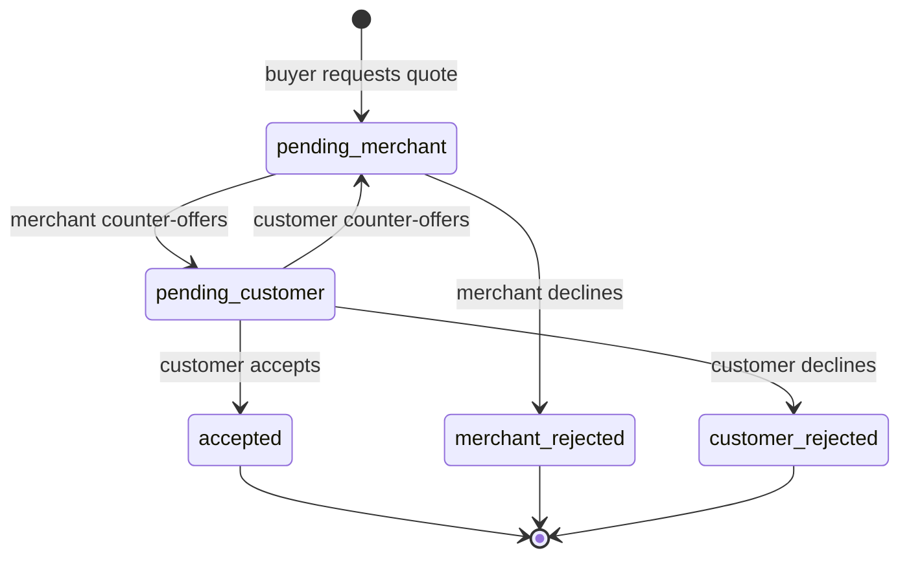
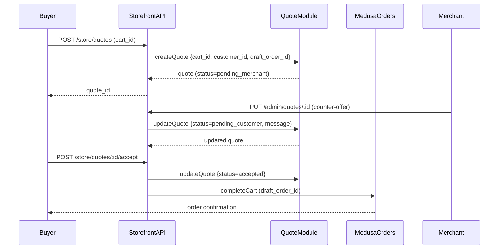

# Entity: Quote Module

**Module path**: [`apps/backend/src/modules/quote`](../../../apps/backend/src/modules/quote)

**Responsibility**: Tracks the lifecycle of a price-negotiation request between a B2B buyer and the merchant. A quote links a Medusa draft order (the cart snapshot) to a negotiation thread of messages and a finite-state status machine.

---

## Models

### Quote

Source: `apps/backend/src/modules/quote/models/quote.ts` (lines 1–20, compiled 2026-06-07)

| Field | Type | Notes |
|-------|------|-------|
| `id` | text (PK, prefix `quo`) | Auto-generated with `quo_` prefix |
| `status` | enum | State machine — see below |
| `customer_id` | text | Medusa customer who initiated the quote |
| `draft_order_id` | text | Medusa draft order (the items + quantities snapshot) |
| `order_change_id` | text | Medusa order change record (tracks price edits) |
| `cart_id` | text | Source cart that triggered the quote request |
| `messages` | has-many | Negotiation thread (`Message` records) |

#### Quote Status State Machine

Source: `apps/backend/src/modules/quote/models/quote.ts` lines 8–14, compiled 2026-06-07



| Status | Who acts next | Meaning |
|--------|---------------|---------|
| `pending_merchant` | Merchant | Initial state; merchant reviews and can counter or reject |
| `pending_customer` | Buyer | Merchant countered; customer reviews |
| `accepted` | — | Terminal; buyer accepted, order can be placed |
| `customer_rejected` | — | Terminal; buyer declined |
| `merchant_rejected` | — | Terminal; merchant declined |

### Message

Source: `apps/backend/src/modules/quote/models/message.ts` (lines 1–11, compiled 2026-06-07)

| Field | Type | Notes |
|-------|------|-------|
| `id` | text (PK, prefix `mess`) | Auto-generated |
| `text` | text | Message body (free-form negotiation notes) |
| `item_id` | text \| null | Optional reference to a specific cart line item |
| `admin_id` | text \| null | Set when the author is a Medusa admin/merchant |
| `customer_id` | text \| null | Set when the author is a B2B buyer |
| `quote` | belongs-to | Parent quote |

A message has either `admin_id` OR `customer_id` set — never both. This allows the storefront to render buyer vs. merchant messages in different styles.

---

## Service

Source: `apps/backend/src/modules/quote/service.ts` (lines 1–4, compiled 2026-06-07)

```typescript
// apps/backend/src/modules/quote/service.ts
class QuoteModuleService extends MedusaService({ Quote, Message }) {}
```

Auto-generated CRUD for both `Quote` and `Message`. No custom methods — all quote-lifecycle transitions (e.g., accepting, rejecting, countering) are handled by workflows that update the `status` field and append `Message` records.

---

## Module Registration

Source: `apps/backend/src/modules/quote/index.ts` (lines 1–6, compiled 2026-06-07)

```typescript
export const QUOTE_MODULE = "quote"
export default Module(QUOTE_MODULE, { service: QuoteModuleService })
```

Resolve in container: `container.resolve("quote")`.

---

## Quote Lifecycle Flow



---

## Migrations

Source: `apps/backend/src/modules/quote/migrations/` (compiled 2026-06-07)

| File | Date | Change |
|------|------|--------|
| `Migration20241010104109.ts` | 2024-10-10 | Initial quote + message tables |
| `Migration20250107125203.ts` | 2025-01-07 | `order_change_id` added; status enum extended |

---

## Related

- [Entity: Company Module](./company-module.md) — company employees initiate quotes
- [Entity: Approval Module](./approval-module.md) — high-value quotes trigger approval workflows
- [Architecture Overview](../architecture/overview.md)
- ADR-012: [`docs/content/architecture/adrs/ADR-012-quote-engine-architecture.md`](../architecture/adrs/ADR-012-quote-engine-architecture.md)
